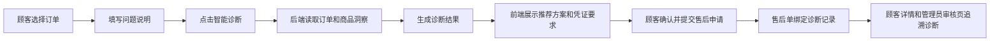

# 售后前置诊断与方案推荐开发计划

## 1. 功能目标

本功能是六项增强计划中的第二项，目标是在顾客正式提交售后申请前，先由系统根据订单状态、商品档案、用户描述、售后规则和凭证情况给出可解释的处理建议。

它不是替代管理员审核，也不是自动退款或自动驳回，而是把“用户想退换货”转成一个可追溯的诊断结果，帮助顾客知道下一步该选退货、换货、仅退款、维修排查、补充凭证还是转人工。

第一版必须做到：

1. 顾客在申请售后弹窗内先填写问题说明，点击“智能诊断”。
2. 后端生成诊断编号、推荐售后类型、决策等级、原因摘要、所需凭证和多方案推荐。
3. 顾客确认后再提交正式售后申请，提交时把诊断结果绑定到售后单。
4. 顾客售后详情页和管理员审核页都能看到诊断结果。
5. AI 不可用时仍有本地规则诊断，关键业务状态仍由 Spring Boot 服务层控制。

## 2. 当前项目适配

当前项目主链路已经具备：

| 能力 | 现有位置 |
| --- | --- |
| 顾客售后申请 | `CustomerAfterSaleCenterView.vue`、`CustomerAfterSaleController`、`AfterSaleApplicationServiceImpl` |
| 售后主表 | `after_sale_application` |
| 处理日志 | `after_sale_process_log` |
| 商品洞察 | `ProductInsightServiceImpl`、`product_profile` |
| AI 本地兜底 | `AiService`、`ChatServiceImpl`、本地规则模板 |
| 管理员审核页 | `AdminAfterSaleReviewView.vue` |

因此，本功能不新建独立演示页面，而是嵌入真实售后申请流程：



## 3. 数据库设计

新增表 `after_sale_diagnosis`。

| 字段 | 类型 | 说明 |
| --- | --- | --- |
| `id` | BIGINT | 主键 |
| `diagnosis_no` | VARCHAR(40) | 诊断编号 |
| `application_id` | BIGINT NULL | 绑定的售后申请，提交前为空 |
| `session_id` | BIGINT NULL | 来源会话，第一版可为空 |
| `order_id` | BIGINT | 订单 |
| `user_id` | BIGINT | 顾客 |
| `issue_text` | VARCHAR(1000) | 用户问题描述 |
| `suggested_service_type` | VARCHAR(30) | RETURN / EXCHANGE / REFUND / COMPLAINT / REPAIR |
| `decision_level` | VARCHAR(30) | ALLOW / NEED_EVIDENCE / MANUAL_REVIEW / REJECT_SUGGESTED |
| `reason_summary` | VARCHAR(1000) | 判断原因 |
| `required_evidence` | VARCHAR(1000) | 需要补充的凭证，用分号分隔 |
| `solution_options_json` | JSON | 多方案推荐 |
| `ai_summary` | VARCHAR(1000) | AI 或本地规则组织后的说明 |
| `ai_status` | VARCHAR(20) | SUCCESS / FAILED / SKIPPED |
| `ai_error_message` | VARCHAR(1000) | AI 错误或跳过说明 |
| `created_at` | DATETIME | 创建时间 |

同时给 `after_sale_application` 新增 `diagnosis_id`，用于把正式售后单和提交前诊断绑定起来。

迁移要求：

- `schema.sql` 使用 `CREATE TABLE IF NOT EXISTS` 和信息架构判断方式补列，兼容旧数据库。
- 不破坏已有售后申请和浏览器冒烟数据。
- `application_id` 和 `diagnosis_id` 双向绑定，方便从诊断查售后，也方便从售后详情直接带诊断。

## 4. 后端接口设计

### 4.1 顾客生成诊断

```http
POST /after-sale-diagnoses
```

请求体：

```json
{
  "orderId": 1,
  "orderNo": "DD202604290001",
  "issueText": "蓝牙耳机降噪感觉不好，想退货",
  "serviceType": "RETURN",
  "refundAmount": 199.00,
  "useAi": false
}
```

说明：

- `orderId` 和 `orderNo` 二选一，前端申请弹窗优先传 `orderId`。
- 顾客只能诊断自己的订单，管理员可用于测试和演示。
- `useAi=false` 时只走本地规则。

返回体：

```json
{
  "id": 12,
  "diagnosisNo": "DG2026051300011234",
  "orderNo": "DD202604290001",
  "productName": "无线蓝牙耳机",
  "suggestedServiceType": "RETURN",
  "decisionLevel": "NEED_EVIDENCE",
  "reasonSummary": "订单已签收，用户关注降噪体验，建议先补充商品实拍和问题说明后按退货规则处理。",
  "requiredEvidenceList": ["商品实拍图", "包装完整性说明"],
  "solutionOptions": [
    { "type": "KEEP", "title": "先排查佩戴和降噪模式", "risk": "低" },
    { "type": "RETURN", "title": "按规则申请退货退款", "risk": "需确认商品完好" },
    { "type": "EXCHANGE", "title": "疑似硬件故障时换货检测", "risk": "需要故障视频" }
  ]
}
```

### 4.2 查询诊断详情

```http
GET /after-sale-diagnoses/{id}
```

权限：

- 顾客只能查看自己的诊断。
- 管理员可以查看所有诊断。

### 4.3 查询会话最新诊断

总计划中要求：

```http
GET /chat-sessions/{id}/after-sale-diagnoses/latest
```

第一版保留该接口，但由于顾客售后申请不是从聊天会话发起，`session_id` 可为空。接口用于后续人工接管和聊天侧联动。

## 5. 本地规则策略

本地规则必须覆盖 AI 不可用场景。

### 5.1 推荐售后类型

| 场景 | 推荐 |
| --- | --- |
| 用户明确投诉、商家不处理、情绪强烈 | `COMPLAINT` |
| 断连、单耳无声、无法充电、按键失灵、屏幕异常等质量问题 | `EXCHANGE` |
| 仅退款、未收到、少件、物流异常 | `REFUND` |
| 不想要、想退、体验不满意、七天无理由 | `RETURN` |
| 轻微使用体验或需要排查 | `REPAIR` |

### 5.2 决策等级

| 场景 | 等级 |
| --- | --- |
| 未支付、订单关闭、已存在进行中售后 | `REJECT_SUGGESTED` |
| 投诉、高金额、物流异常、超过常规可判断范围 | `MANUAL_REVIEW` |
| 质量问题、体验问题、证据不足 | `NEED_EVIDENCE` |
| 状态清晰且风险较低 | `ALLOW` |

### 5.3 所需凭证

| 场景 | 凭证 |
| --- | --- |
| 体验不满意 | 商品实拍图、包装完整性说明 |
| 质量故障 | 故障视频、商品外观照片、订单截图 |
| 物流异常 | 物流截图、签收/拒收说明 |
| 投诉 | 沟通记录、期望处理方式 |
| 高金额 | 商品全套照片、包装配件清单 |

## 6. 与正式售后申请的绑定

`AfterSaleApplicationCreateRequest` 增加 `diagnosisId`。

提交售后时：

1. Service 校验诊断存在。
2. 顾客只能使用自己的诊断。
3. 诊断订单必须和申请订单一致。
4. 诊断未绑定其他售后申请。
5. 插入售后申请后，把 `after_sale_diagnosis.application_id` 更新为申请 ID。
6. 把 `after_sale_application.diagnosis_id` 更新为诊断 ID。
7. 写入处理日志，动作使用 `SYSTEM_MARK`，说明已绑定前置诊断。

这样管理员审核时能直接看到“系统为什么建议这个路径”，而不是只看用户一句话。

## 7. 前端设计

### 7.1 顾客售后申请弹窗

在 `CustomerAfterSaleCenterView.vue` 的申请弹窗中增加一个“智能诊断”区块：

- 问题说明填写后可以点击“智能诊断”。
- 诊断中按钮显示 loading。
- 成功后展示：
  - 推荐售后类型
  - 决策等级
  - 原因摘要
  - 所需凭证
  - 多方案推荐
- 若诊断推荐类型与当前用户选择不同，前端提示并可自动带入推荐类型。
- 未诊断也允许提交，但页面给出“建议先诊断”的提醒；为了演示效果，默认鼓励先诊断。

### 7.2 顾客售后详情

在详情页“处理结果说明”附近展示诊断卡片：

- 诊断编号
- 推荐方案
- 决策等级
- 凭证要求

### 7.3 管理员审核页

在 `AdminAfterSaleReviewView.vue` 的审核处理台中展示同一诊断卡片，放在“AI 摘要”和“关联客服工单”之间，帮助客服快速判断是否要通过、补证或转人工。

## 8. 后端类设计

新增：

- `AfterSaleDiagnosis`
- `AfterSaleDiagnosisRequest`
- `AfterSaleDiagnosisMapper`
- `AfterSaleDiagnosisMapper.xml`
- `AfterSaleDiagnosisService`
- `AfterSaleDiagnosisServiceImpl`
- `AfterSaleDiagnosisController`

修改：

- `NoUtils` 增加 `diagnosisNo()`
- `AfterSaleApplicationCreateRequest` 增加 `diagnosisId`
- `AfterSaleApplication` 增加 `diagnosisId` 和 `diagnosis`
- `AfterSaleApplicationMapper.xml` 查询 `diagnosis_id`
- `AfterSaleApplicationServiceImpl.create` 绑定诊断
- `StatusTag.vue` 增加诊断状态和推荐类型文案
- `customerAfterSaleApi.js` 增加诊断接口
- `CustomerAfterSaleCenterView.vue` 接入弹窗和详情展示
- `AdminAfterSaleReviewView.vue` 接入审核页展示

## 9. 验证计划

必须执行：

1. 数据库：执行 `sql/schema.sql`，确认 `after_sale_diagnosis` 可访问，`after_sale_application.diagnosis_id` 存在。
2. 后端编译：`mvn -q -DskipTests package`
3. 前端构建：`npm run build`
4. 接口冒烟：
   - 登录顾客
   - `POST /after-sale-diagnoses`
   - `GET /after-sale-diagnoses/{id}`
   - `POST /customer/after-sales` 携带 `diagnosisId`
   - `GET /customer/after-sales/{id}` 返回诊断
5. 浏览器验证：
   - 顾客打开申请售后弹窗
   - 输入“蓝牙耳机降噪不好想退”
   - 点击“智能诊断”
   - 页面出现推荐类型、原因、凭证和方案
   - 提交后详情页能看到诊断卡片
   - 管理员审核页也能看到诊断卡片

## 10. 自审与修正

### 10.1 初版风险

1. 如果只做独立接口，不接入顾客提交弹窗，演示时会像“额外工具”，不符合真实业务。
2. 如果只把诊断结果展示给顾客，不绑定售后单，管理员审核时仍然要重新判断。
3. 如果诊断直接决定退款或驳回，会违背当前项目“AI 只辅助、业务状态机控制”的约束。
4. 如果强制必须诊断才能提交，会影响已有浏览器冒烟脚本和真实用户紧急提交。

### 10.2 修正后的落地边界

1. 诊断嵌入申请弹窗，但不强制阻断提交。
2. 诊断结果通过 `diagnosisId` 绑定售后申请，并在顾客端、管理员端都展示。
3. 诊断只输出建议和解释，不自动修改订单、退款、审核状态。
4. 本地规则优先保证稳定，AI 只用于生成更自然的摘要。
5. 第一版 `session_id` 允许为空，保留会话最新诊断接口给后续人工接管功能使用。

### 10.3 可实施性结论

该方案与现有 Spring Boot + Vue 3 + MySQL + LangChain4j 架构一致，改动集中在售后申请链路，不会破坏已有订单、售后、工单和聊天主流程。第一版可以作为可演示、可验证、可追溯的真实业务增强功能落地。
