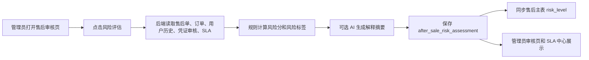

# 售后风险识别开发计划

## 1. 功能目标

本功能是六项售后增强计划中的第四项，目标是为每个售后申请生成一份可追溯的风险评估，让管理员在审核前知道这张单为什么需要优先处理、为什么不能直接退款、哪些信号需要人工复核。

第一版不做自动驳回、自动退款、自动处罚用户。风险识别只作为管理员审核辅助，真正的售后状态流转仍由 `AfterSaleApplicationServiceImpl` 的审核动作控制。

第一版必须做到：

1. 管理员可以对某个售后申请触发风险评估。
2. 后端保存风险等级、风险分、风险标签、风险原因、建议处理动作和规则详情。
3. 风险评估会读取订单金额、用户历史、售后类型、SLA、凭证审核结果和证据充分性。
4. 管理员审核页展示“售后风险识别卡片”。
5. SLA 中心展示最新风险标签和风险分，帮助管理员按风险处理。
6. 客户画像页展示用户维度风险历史，但不向顾客端暴露敏感风控判断。

## 2. 当前项目适配

当前项目已经具备：

| 能力 | 现有位置 | 本功能改动 |
| --- | --- | --- |
| 售后主表风险等级 | `after_sale_application.risk_level` | 评估后同步最新 `risk_level` |
| 顾客历史聚合 | `AfterSaleApplicationMapper.countByUserSince`、客户画像聚合 | 复用短期售后、投诉、重复售后统计 |
| SLA 风险 | `SlaTaskServiceImpl`、`SlaCenterView.vue` | 增加风险分、风险标签和最新评估摘要 |
| 凭证真实性审核 | `evidence_audit`、`EvidenceAuditService` | 读取 AI 生成风险、篡改风险、凭证充分性 |
| 管理员审核页 | `AdminAfterSaleReviewView.vue` | 新增风险评估卡片和重新评估按钮 |

业务流：



## 3. 数据库设计

新增表 `after_sale_risk_assessment`，每个售后申请保留一条当前风险评估记录，重复评估时更新同一行。

| 字段 | 类型 | 说明 |
| --- | --- | --- |
| `id` | BIGINT | 主键 |
| `assessment_no` | VARCHAR(40) | 风险评估编号 |
| `application_id` | BIGINT | 售后申请 |
| `risk_level` | VARCHAR(20) | LOW / MEDIUM / HIGH |
| `risk_score` | INT | 0-100 |
| `risk_tags` | VARCHAR(500) | 逗号分隔标签 |
| `risk_reasons` | VARCHAR(1000) | 风险原因 |
| `suggested_action` | VARCHAR(1000) | 建议处理动作 |
| `rule_detail_json` | JSON | 规则命中详情 |
| `ai_summary` | VARCHAR(1000) | AI 或本地规则说明 |
| `ai_status` | VARCHAR(20) | SUCCESS / FAILED / SKIPPED |
| `ai_error_message` | VARCHAR(1000) | AI 错误或跳过说明 |
| `created_at` | DATETIME | 创建时间 |
| `updated_at` | DATETIME | 更新时间 |

迁移要求：

- `application_id` 唯一，保证审核页只显示最新评估。
- `risk_level`、`risk_score` 建索引，支持风险队列筛选。
- 新增流程日志动作 `RISK_ASSESSMENT`，便于答辩时展示评估可追溯。

## 4. 后端接口设计

新增：

```http
POST /admin/after-sales/{id}/risk-assessment
GET  /admin/after-sales/{id}/risk-assessment
GET  /admin/risk-assessments?page=1&pageSize=10&riskLevel=HIGH
```

接口规则：

- 仅管理员可访问。
- `POST` 只生成或更新评估记录，不自动通过、驳回或退款。
- `POST` 会同步 `after_sale_application.risk_level`，让既有列表、客户画像、回复草稿和 SLA 页面能使用最新风险等级。
- `GET /admin/after-sales/{id}/risk-assessment` 如果暂无评估，返回空，由前端显示“尚未评估”。

## 5. 风险规则

第一版采用本地规则，规则透明可解释。AI 只作为解释层，不作为最终决策。

| 规则 | 加分 | 标签 |
| --- | --- | --- |
| 退款金额超过 500 | +15 | 高金额 |
| 退款金额超过 300 | +10 | 中高金额 |
| 用户 30 天内售后超过 3 次 | +20 | 高频售后用户 |
| 用户有投诉历史或当前为投诉 | +20 | 投诉风险 |
| 用户低评分评价超过 1 次 | +15 | 低满意度历史 |
| 当前凭证不足或待补材料 | +15 | 证据不足 |
| 最新凭证审核为 `RISKY` | +25 | 凭证高风险 |
| 最新凭证 AI 生成风险为 `HIGH` | +20 | 疑似 AI 凭证 |
| 最新凭证篡改风险为 `HIGH` | +15 | 疑似篡改 |
| SLA 已超时 | +20 | SLA 已超时 |
| SLA 24 小时内到期 | +10 | SLA 临近 |
| 同商品 7 天内售后超过 3 次 | +15 | 商品集中问题 |

等级：

- `LOW`：0-29
- `MEDIUM`：30-59
- `HIGH`：60-100

建议动作：

- `LOW`：按标准规则审核。
- `MEDIUM`：优先核对凭证和用户历史，必要时要求补材料。
- `HIGH`：建议资深客服人工复核，先补齐证据链，不直接退款或驳回。

## 6. 前端设计

新增组件：

- `web/src/components/after-sale/AfterSaleRiskPanel.vue`

管理员审核页：

- 在凭证审核卡片下方展示“售后风险识别”。
- 显示风险等级、风险分、风险标签、风险原因、建议动作、AI/本地摘要。
- 提供“重新评估”按钮。

SLA 中心：

- 表格增加风险等级、风险分、风险标签。
- 风险标签优先显示最新评估的标签；没有评估时保留原 SLA 标签。

客户画像页：

- 最近售后列表显示售后单风险等级。
- 运营判断仍然是内部视角，不在顾客端展示。

## 7. 验收标准

1. 执行 `sql/schema.sql` 后，`after_sale_risk_assessment` 表可访问。
2. 管理员触发 `POST /admin/after-sales/{id}/risk-assessment` 能生成风险评估。
3. 管理员售后详情页能看到风险等级、风险分、标签、原因和建议动作。
4. SLA 中心能显示最新风险评估字段。
5. 风险评估不会自动改售后状态，只同步主表 `risk_level`。
6. `mvn -q -DskipTests package` 通过。
7. `npm run build` 通过。
8. `npm run test:browser` 和 `tools/full-smoke-test.ps1` 覆盖风险评估并通过。

## 8. 自审与修订

### 8.1 初稿风险

1. 如果把风险识别写成“自动拦截退款”，容易显得不符合真实售后流程，也破坏管理员审核边界。
2. 如果风险规则只看金额，会和已有 `risk_level` 重复，功能亮点不足。
3. 如果风险评估不读取凭证审核结果，就无法和上一功能形成闭环。
4. 如果只在审核页展示，不进入 SLA 队列和脚本验收，后续容易变成孤立演示卡片。

### 8.2 修订结果

1. 风险评估只做辅助判断，不自动改变售后状态。
2. 规则融合用户历史、凭证真实性、SLA、商品集中问题和订单金额，不只是金额判断。
3. 评估后同步主表 `risk_level`，让现有队列、草稿和画像能复用。
4. 增加 SLA 中心展示和全链路脚本验收，保证功能不是孤立展示。

自审结论：计划可以实施。该功能能把前置诊断、凭证审核、SLA 和客户画像串起来，更像真实平台的售后风控工作台。
