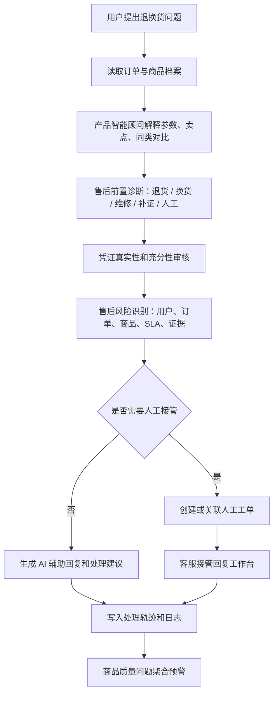

# AI 智能售后决策闭环六项功能开发计划

## 1. 文档目标

本文档用于规划本项目下一轮“真实业务可用型”增强开发。目标不是继续堆聊天能力，而是把系统升级为围绕退换货真实业务运行的 AI 智能售后决策闭环。

本轮计划保留六个核心功能：

1. 产品智能顾问
2. 售后前置诊断与方案推荐
3. AI 凭证真实性审核
4. 售后风险识别
5. 商品质量问题聚合预警
6. 人工接管回复工作台

这六个功能必须符合当前项目框架：Spring Boot + Vue 3 + MySQL + LangChain4j。LangChain4j 只作为 AI 增强层，订单、售后、工单、权限、状态机、风险等级和处理记录仍由 Spring Boot 服务层控制。本地规则兜底必须保留，不能把退款、驳回、状态流转等关键动作交给 AI 自动决定。

## 2. 当前项目基础

当前系统已经具备以下可复用基础：

| 已有能力 | 对应模块 |
| --- | --- |
| 用户、管理员登录与权限控制 | `AuthController`、`AuthServiceImpl`、`AuthInterceptor` |
| 订单查询与售后状态 | `demo_order`、`OrderController`、`DemoOrderMapper` |
| 客户售后申请与进度跟踪 | `after_sale_application`、`CustomerAfterSaleController` |
| 管理员售后审核、补证、通过、驳回、完成 | `AdminAfterSaleController`、`AfterSaleApplicationServiceImpl` |
| 售后凭证与处理时间线 | `after_sale_evidence`、`after_sale_process_log` |
| AI 聊天、意图识别、知识库检索、处理轨迹 | `ChatServiceImpl`、`intent_record`、`retrieval_log`、`process_trace` |
| 人工工单与 AI 回复草稿 | `service_ticket`、`reply_draft`、`ServiceTicketView.vue` |
| 日志诊断和演示数据 | `ai_call_log`、`LogCenterView.vue`、`sql/demo-usage-data.sql` |

因此本轮开发应优先复用已有表和页面，在必要处新增少量业务表。不要重新做一套独立 AI 系统，也不要绕过现有售后状态机。

## 3. 总体业务闭环

目标闭环如下：



演示时应体现：系统不是直接把用户问题丢给大模型，而是先查订单、查商品、查规则、查证据，再由 AI 组织表达，最终由业务状态机和人工确认完成关键动作。

## 4. 六项功能设计

### 4.1 产品智能顾问

#### 目标

用户在退换货前提出商品相关问题时，系统能结合订单商品解释产品参数、卖点、适用场景、常见问题、使用排查步骤和同类对比。

示例：

```text
用户：我想退这个蓝牙耳机，感觉降噪没有宣传那么好。
系统：识别订单商品为无线蓝牙耳机 Pro，先说明该商品支持 ANC 主动降噪、通勤场景效果较好；
再提示降噪效果受耳塞尺寸、佩戴密封性、环境模式影响；
最后给出处理建议：可先尝试更换耳塞和切换深度降噪模式，仍不满意可走七天无理由退货，疑似单耳故障则建议换货检测。
```

#### 后端设计

新增商品档案表 `product_profile`：

| 字段 | 说明 |
| --- | --- |
| `id` | 主键 |
| `product_name` | 商品名，用于和 `demo_order.product_name` 匹配 |
| `category` | 商品品类，例如蓝牙耳机、机械键盘、智能手表 |
| `positioning` | 商品定位，例如中端降噪耳机 |
| `spec_json` | 核心参数 JSON，例如续航、蓝牙版本、材质 |
| `selling_points` | 卖点说明 |
| `common_issues` | 常见问题 |
| `troubleshooting_steps` | 排查步骤 |
| `comparison_text` | 同类对比说明 |
| `retention_script` | 售前/售后挽留话术 |
| `enabled` | 是否启用 |
| `created_at`、`updated_at` | 时间字段 |

新增后端模块：

| 层 | 建议文件 |
| --- | --- |
| POJO | `ProductProfile.java`、`ProductInsight.java` |
| Mapper | `ProductProfileMapper.java`、`ProductProfileMapper.xml` |
| Service | `ProductProfileService.java`、`ProductInsightService.java` |
| Controller | `ProductProfileController.java`、`ProductInsightController.java` |

新增接口：

```http
GET  /product-profiles
POST /product-profiles
PUT  /product-profiles/{id}
GET  /orders/{id}/product-insight
GET  /orders/no/{orderNo}/product-insight
```

LangChain4j 工具扩展：

```java
String queryProductProfile(String orderNo);
String compareProductForAfterSale(String orderNo, String userIssue);
```

#### 前端设计

在 `ChatWorkbenchView.vue` 右侧洞察面板新增“产品智能洞察”区域：

- 商品定位
- 核心参数
- 用户关注点
- 常见问题命中
- 排查建议
- 同类对比
- 留客话术
- 售后建议

管理员侧可在知识库或单独页面维护商品档案。第一版可以只做查询和展示，维护功能放到第二版。

### 4.2 售后前置诊断与方案推荐

#### 目标

在用户正式提交售后前，系统先根据订单、商品、用户描述、售后规则和证据情况给出处理路径。

输出结果不应只有“能退/不能退”，而应包含：

- 建议退货退款
- 建议换货检测
- 建议维修
- 需要补充凭证
- 建议人工介入
- 暂不支持直接退款

#### 后端设计

新增诊断结果表 `after_sale_diagnosis`：

| 字段 | 说明 |
| --- | --- |
| `id` | 主键 |
| `diagnosis_no` | 诊断编号 |
| `application_id` | 可为空，未正式提交前可为空 |
| `session_id` | 来源会话 |
| `order_id` | 订单 |
| `user_id` | 用户 |
| `issue_text` | 用户问题描述 |
| `suggested_service_type` | RETURN / EXCHANGE / REFUND / COMPLAINT / REPAIR |
| `decision_level` | ALLOW / NEED_EVIDENCE / MANUAL_REVIEW / REJECT_SUGGESTED |
| `reason_summary` | 判断原因 |
| `required_evidence` | 需要补充的凭证 |
| `solution_options_json` | 多方案推荐 JSON |
| `ai_summary` | AI 组织后的说明 |
| `created_at` | 创建时间 |

新增接口：

```http
POST /after-sale-diagnoses
GET  /after-sale-diagnoses/{id}
GET  /chat-sessions/{id}/after-sale-diagnoses/latest
```

请求示例：

```json
{
  "orderNo": "OPS202605120002",
  "issueText": "蓝牙耳机降噪感觉不好，想退货",
  "evidenceIds": []
}
```

返回示例：

```json
{
  "suggestedServiceType": "RETURN",
  "decisionLevel": "NEED_EVIDENCE",
  "reasonSummary": "订单已签收且在可售后期内，但当前问题偏体验不满意，需要先确认是否影响二次销售。",
  "requiredEvidence": ["商品实拍图", "包装完整性说明"],
  "solutionOptions": [
    {"type": "KEEP", "title": "先排查佩戴和降噪模式", "cost": 0},
    {"type": "RETURN", "title": "七天无理由退货", "risk": "需确认包装完整"},
    {"type": "EXCHANGE", "title": "疑似硬件故障时换货检测", "risk": "需要故障视频"}
  ]
}
```

#### 前端设计

在客户售后申请弹窗中增加“智能诊断”步骤：

1. 选择订单
2. 填写问题描述
3. 点击“智能诊断”
4. 展示建议方案和所需凭证
5. 用户确认后再提交正式售后申请

管理员审核页也展示诊断结果，避免客服重新读一遍用户描述。

### 4.3 AI 凭证真实性审核

#### 目标

用户上传图片说明、视频说明、物流单号或文字凭证后，系统判断凭证是否足够、是否和问题匹配、是否存在疑似 AI 生成或篡改风险。

注意：第一版不承诺 100% 判断图片真假，只输出“风险信号”和“建议补证”。隐藏水印、C2PA、EXIF、视觉异常都只能作为信号，不能直接作为自动退款或自动驳回依据。

#### 后端设计

复用 `after_sale_evidence`，新增凭证审核表 `evidence_audit`：

| 字段 | 说明 |
| --- | --- |
| `id` | 主键 |
| `audit_no` | 审核编号 |
| `application_id` | 售后申请 |
| `evidence_id` | 对应凭证 |
| `audit_status` | PASS / NEED_MORE / RISKY / MANUAL_REVIEW |
| `sufficiency_level` | SUFFICIENT / PARTIAL / INSUFFICIENT |
| `authenticity_risk` | LOW / MEDIUM / HIGH |
| `ai_generated_risk` | LOW / MEDIUM / HIGH |
| `tamper_risk` | LOW / MEDIUM / HIGH |
| `metadata_signal` | EXIF、编辑软件、C2PA 等元数据信号 |
| `visual_signal` | 视觉异常说明 |
| `watermark_signal` | 水印或来源信号说明 |
| `required_evidence` | 建议补充凭证 |
| `audit_detail_json` | 详细信号 JSON |
| `ai_status` | SUCCESS / FAILED / SKIPPED |
| `created_at` | 创建时间 |

新增接口：

```http
POST /after-sale-evidences/{id}/audits
GET  /after-sale-evidences/{id}/audits
GET  /admin/after-sales/{id}/evidence-audits
```

第一版实现策略：

- 文本凭证：规则判断是否包含问题描述、物流号、签收时间、故障现象。
- 图片凭证：先基于 `file_url`、`content` 和模拟元数据做风险判断。
- AI 模型可用时：让模型对凭证描述进行一致性审核，不直接做最终真假判定。
- AI 不可用时：本地规则返回 `SKIPPED`，仍能给出补证建议。

#### 前端设计

在客户售后详情页显示：

- 当前凭证是否充分
- 还需补充什么
- 为什么不能直接退款

在管理员审核页显示“凭证真实性审核卡片”：

- 真实性风险
- AI 生成风险
- 篡改风险
- 元数据信号
- 视觉一致性说明
- 建议操作：通过 / 补证 / 人工复核

### 4.4 售后风险识别

#### 目标

系统对每个售后申请给出风险等级和风险原因，让管理员知道哪些单子要优先处理、哪些单子不能直接退款。

风险来源包括：

- 用户短期多次售后
- 用户低评分或投诉历史
- 高金额订单
- 商品高争议
- 证据不足
- 疑似 AI 生成凭证
- 临近 SLA 或已超时
- 投诉转人工

#### 后端设计

新增风险评估表 `after_sale_risk_assessment`：

| 字段 | 说明 |
| --- | --- |
| `id` | 主键 |
| `application_id` | 售后申请 |
| `risk_level` | LOW / MEDIUM / HIGH |
| `risk_score` | 0-100 |
| `risk_tags` | 逗号分隔标签 |
| `risk_reasons` | 风险原因 |
| `suggested_action` | 建议处理动作 |
| `rule_detail_json` | 规则命中详情 |
| `ai_summary` | AI 总结 |
| `created_at` | 创建时间 |
| `updated_at` | 更新时间 |

风险规则第一版：

| 规则 | 加分 |
| --- | --- |
| 退款金额超过 500 | +15 |
| 用户 30 天内售后超过 3 次 | +20 |
| 投诉类型申请 | +20 |
| 凭证不足 | +15 |
| AI 生成风险高 | +20 |
| SLA 已超时 | +20 |
| 商品近期同类问题集中 | +15 |

新增接口：

```http
POST /admin/after-sales/{id}/risk-assessment
GET  /admin/after-sales/{id}/risk-assessment
GET  /admin/risk-assessments?page=1&pageSize=10&riskLevel=HIGH
```

#### 前端设计

在 `AdminAfterSaleReviewView.vue` 和 `SlaCenterView.vue` 显示风险标签：

- 高风险
- 证据不足
- 疑似 AI 凭证
- 高频售后用户
- 临近 SLA

在客户画像页显示用户维度的售后风险历史，但不要给用户侧展示过于敏感的风控判断。

### 4.5 商品质量问题聚合预警

#### 目标

系统从多个售后申请中发现同一商品的集中问题，提示运营检查商品质量或批次风险。

示例：

```text
最近 7 天“无线蓝牙耳机 Pro”出现 5 次售后，其中 3 次集中在“左耳无声/断连”，建议运营检查该批次商品质量。
```

#### 后端设计

第一版可不新增写入表，直接聚合已有数据：

- `demo_order.product_name`
- `after_sale_application.reason_text`
- `after_sale_application.service_type`
- `after_sale_application.status`
- `service_ticket.customer_issue`
- `service_review.rating`

如果需要保存预警结果，可新增 `product_issue_alert`：

| 字段 | 说明 |
| --- | --- |
| `id` | 主键 |
| `product_name` | 商品名 |
| `issue_keyword` | 问题关键词 |
| `issue_count` | 问题次数 |
| `application_count` | 售后申请数 |
| `time_window_days` | 统计窗口 |
| `alert_level` | LOW / MEDIUM / HIGH |
| `sample_application_ids` | 样本售后单 |
| `suggested_action` | 建议动作 |
| `created_at` | 创建时间 |

新增接口：

```http
GET  /admin/product-issue-insights?days=7
POST /admin/product-issue-insights/refresh
```

关键词第一版可用规则抽取：

- 耳机：无声、断连、降噪、破音、续航
- 键盘：连击、失灵、灯光、轴体
- 手表：表带、充电、定位、屏幕
- 物流：破损、少件、丢件、延迟

#### 前端设计

新增或复用后台运营区域展示“商品质量预警”：

- 问题商品排行
- 高频问题关键词
- 最近 7 天/30 天趋势
- 样本售后单跳转
- 建议动作：检查批次、补充 FAQ、通知仓库、暂停自动退款

这个功能适合放在 `DashboardView.vue` 或新增 `ProductIssueInsightView.vue`。

### 4.6 人工接管回复工作台

#### 目标

当 AI 判断需要人工介入时，管理员能在后台看到用户原始聊天、订单、商品洞察、售后申请、风险评估、凭证审核和 AI 草稿，并直接发送人工回复。

它不需要做成完整实时 IM，第一版只要做到：

- 管理员在工单详情中输入人工回复
- 后端写入 `chat_message`
- 用户聊天页刷新后能看到人工回复
- 工单状态可更新
- 处理记录可追踪

#### 后端设计

扩展 `chat_message.source_type`：

当前只支持 `RULE_TEMPLATE`、`AI_ENHANCED`、`FALLBACK`。需要新增：

```text
MANUAL
AI_DRAFT
SYSTEM_NOTICE
```

新增接口：

```http
POST /service-tickets/{id}/manual-replies
GET  /service-tickets/{id}/conversation
POST /service-tickets/{id}/take-over
POST /service-tickets/{id}/resolve
```

请求示例：

```json
{
  "content": "您好，已收到您反馈的耳机左耳无声问题。请您补充一段故障视频，我们会优先为您安排换货检测。",
  "useDraftId": 12
}
```

写入逻辑：

1. 校验管理员权限。
2. 查询工单关联 `session_id`。
3. 写入 `chat_message`，`role='ASSISTANT'`，`source_type='MANUAL'`。
4. 更新工单状态为 `PROCESSING` 或保持当前状态。
5. 如果关联售后申请，写入 `after_sale_process_log`。

#### 前端设计

在 `ServiceTicketView.vue` 增加三栏处理工作台：

| 区域 | 内容 |
| --- | --- |
| 左侧 | 工单列表、状态、优先级、SLA |
| 中间 | 用户会话记录、人工回复输入框 |
| 右侧 | 订单信息、商品洞察、风险评估、凭证审核、AI 回复草稿 |

按钮：

- 接管会话
- 生成回复草稿
- 采用草稿
- 发送人工回复
- 标记处理中
- 标记已解决

## 5. 数据库变更汇总

建议新增或扩展以下数据结构：

| 变更 | 是否必须 | 说明 |
| --- | --- | --- |
| `product_profile` | 必须 | 支撑产品智能顾问 |
| `after_sale_diagnosis` | 必须 | 支撑前置诊断和方案推荐 |
| `evidence_audit` | 必须 | 支撑凭证真实性审核 |
| `after_sale_risk_assessment` | 必须 | 支撑风险识别 |
| `product_issue_alert` | 可选 | 第一版可实时聚合，第二版再落表 |
| `chat_message.source_type` 新增枚举 | 必须 | 支撑人工回复 |
| `process_trace.step_name` 新增步骤 | 必须 | 记录产品洞察、诊断、凭证审核、风险识别 |

新增处理轨迹建议：

| 步骤 | 说明 |
| --- | --- |
| `PRODUCT_PROFILE_LOOKUP` | 查询商品档案 |
| `PRODUCT_INSIGHT_GENERATE` | 生成产品洞察 |
| `AFTER_SALE_DIAGNOSIS` | 售后前置诊断 |
| `EVIDENCE_AUDIT` | 凭证真实性审核 |
| `RISK_ASSESSMENT` | 风险识别 |
| `MANUAL_TAKEOVER_CHECK` | 是否需要人工接管 |
| `MANUAL_REPLY_SENT` | 人工回复已发送 |
| `PRODUCT_ISSUE_ALERT` | 商品问题聚合预警 |

## 6. 后端实施范围

### 6.1 Controller

建议新增：

```text
ProductProfileController
ProductInsightController
AfterSaleDiagnosisController
EvidenceAuditController
RiskAssessmentController
ProductIssueInsightController
ManualReplyController
```

接口命名遵守 REST 资源风格，不使用动词型路径作为主资源名。涉及动作时放在资源子路径下，例如：

```http
POST /service-tickets/{id}/manual-replies
POST /admin/after-sales/{id}/risk-assessment
POST /after-sale-evidences/{id}/audits
```

### 6.2 Service

建议新增：

```text
ProductInsightService
AfterSaleDiagnosisService
EvidenceAuditService
RiskAssessmentService
ProductIssueInsightService
ManualReplyService
```

AI 只在 Service 内作为增强步骤调用。所有关键判断必须先有本地规则版本：

- AI 不可用时，诊断仍返回本地规则建议。
- AI 不可用时，风险等级仍由规则计算。
- AI 不可用时，凭证审核仍能提示补证。
- AI 不可用时，人工回复仍可手写发送。

### 6.3 LangChain4j 工具

扩展 `AiBusinessToolService`：

```java
String queryProductProfile(String orderNo);

String generateProductInsight(String orderNo, String userIssue);

String diagnoseAfterSale(String orderNo, String userIssue);

String auditEvidence(Long applicationId);

String assessAfterSaleRisk(Long applicationId);

String summarizeProductIssueTrend(String productName);
```

这些工具只能查询和生成建议，不能直接改订单、退款或审核状态。

## 7. 前端实施范围

### 7.1 客户端

重点改造：

| 页面 | 改造内容 |
| --- | --- |
| `ChatWorkbenchView.vue` | 新增产品洞察、前置诊断、补证建议展示 |
| `CustomerAfterSaleCenterView.vue` | 提交前增加智能诊断步骤，详情页展示补证要求和凭证审核结果 |

客户侧文案应偏“下一步我该做什么”，例如：

- 当前凭证不足，建议补充故障视频。
- 商品仍在可售后时间内，可申请退货。
- 疑似质量问题，更建议换货检测。

### 7.2 管理端

重点改造：

| 页面 | 改造内容 |
| --- | --- |
| `AdminAfterSaleReviewView.vue` | 展示诊断、凭证审核、风险识别、商品洞察 |
| `ServiceTicketView.vue` | 改造成可人工接管和回复的工单工作台 |
| `DashboardView.vue` 或新增页面 | 展示商品质量问题聚合预警 |
| `LogCenterView.vue` | 增加新处理轨迹和 AI 调用证据 |

管理端必须体现“客服处理任务”，不是只看数据。每个高风险提示都应能跳到具体售后单或工单。

## 8. 分阶段开发计划

### 阶段一：商品智能顾问 + 前置诊断

目标：正面回应老师提出的“退换货时能不能了解产品数据、智能对齐对比”。

任务：

- 新增 `product_profile` 表和种子数据。
- 新增商品洞察接口。
- 扩展聊天响应，返回 `productInsight`。
- 新增 `after_sale_diagnosis` 表和诊断接口。
- 客户申请售后前展示诊断建议。
- 聊天右侧展示产品洞察卡片。

验证：

- `mvn -q -DskipTests package`
- `npm run build`
- 接口冒烟：商品洞察、诊断接口、聊天返回 productInsight
- 浏览器测试：聊天页能看到产品洞察，售后申请页能看到诊断建议

### 阶段二：凭证真实性审核 + 售后风险识别

目标：让系统具备真实平台风控能力。

任务：

- 新增 `evidence_audit` 表和审核接口。
- 新增 `after_sale_risk_assessment` 表和风险接口。
- 管理员审核页展示凭证风险和售后风险。
- 售后状态流转时自动刷新风险等级。
- 高风险单进入 SLA 或审核队列显著提示。

验证：

- 数据库脚本执行后新增表可访问。
- 后端编译通过。
- 接口冒烟：补证、审核凭证、风险评估。
- 浏览器测试：管理员审核页显示风险原因。

### 阶段三：人工接管回复工作台

目标：形成 AI 预处理 + 人工确认 + 全流程留痕的真实客服协作模式。

任务：

- 扩展 `chat_message.source_type` 支持 `MANUAL`。
- 新增工单人工回复接口。
- `ServiceTicketView.vue` 增加会话记录和人工回复输入框。
- 发送人工回复后写入聊天消息和处理日志。
- 用户聊天页能看到人工回复。

验证：

- 后端编译。
- 前端构建。
- 接口冒烟：创建工单、接管、发送人工回复、查询会话。
- 浏览器测试：管理员发送人工回复，用户聊天页可见。

### 阶段四：商品质量问题聚合预警

目标：把单个售后处理升级为运营分析能力。

任务：

- 新增商品问题聚合接口。
- 规则抽取商品问题关键词。
- 后台展示问题商品排行、关键词、样本售后单。
- 高问题商品影响风险评估。

验证：

- 接口冒烟：`GET /admin/product-issue-insights?days=7`
- 浏览器测试：后台能看到商品质量预警。
- 演示数据覆盖蓝牙耳机断连、键盘连击、物流异常等场景。

## 9. 演示路线

建议最终演示按以下脚本：

1. 用户进入聊天或售后中心，选择“无线蓝牙耳机 Pro”订单。
2. 用户输入：“我想退这个蓝牙耳机，降噪感觉没有宣传那么好。”
3. 系统展示产品智能顾问：参数、卖点、同类对比、排查步骤。
4. 系统展示前置诊断：建议先排查佩戴和降噪模式；仍不满意可退货；疑似故障建议换货检测。
5. 用户提交售后并上传一条可疑凭证。
6. 管理端显示凭证真实性审核：疑似 AI 生成/证据不足，需要补充故障视频和序列号照片。
7. 管理端显示售后风险：中高风险，原因是凭证不足、商品近期同类问题集中。
8. 系统创建人工工单，客服在人工接管工作台采用 AI 草稿并手动发送回复。
9. 后台商品质量预警显示：蓝牙耳机最近多次出现断连/降噪问题，建议运营检查批次。

这条路线能同时体现六个功能，而且逻辑连贯。

## 10. 验收标准

### 10.1 业务验收

- 用户不需要理解后台规则，也能知道自己下一步该补什么材料。
- 管理员能看到诊断、凭证、风险、商品问题和对话证据。
- AI 不直接退款、不直接驳回、不绕过管理员。
- 人工回复能写入同一会话，用户侧可见。
- 商品质量预警能从多条售后记录中聚合出问题趋势。

### 10.2 技术验收

- 所有新增接口遵守 REST 风格。
- 所有新增表写入 `sql/schema.sql`，演示数据写入对应 seed 或 demo 数据脚本。
- MyBatis Mapper、Service、Controller 分层清晰。
- LangChain4j 调用失败时，本地规则兜底可用。
- `process_trace`、`ai_call_log`、`after_sale_process_log` 能记录关键证据。
- 客户和管理员权限边界不被破坏。

### 10.3 验证命令

每轮代码修改完成后按范围执行：

```powershell
# 后端
mvn -q -DskipTests package

# 前端
npm run build

# 全链路
tools/full-smoke-test.ps1

# 浏览器
npm run test:browser
npm run test:browser:roles

# 工作区检查
git status --short
```

涉及数据库变更时：

```powershell
mysql --host=127.0.0.1 --port=3306 --user=root --password=1234 --default-character-set=utf8mb4 --database=test3 --execute="SOURCE sql/schema.sql"
```

实际执行时不要提交 `.env`、`output/`、`tmp/`、`web/dist/`、`server/target/`、`node_modules/` 等运行产物，也不要提交真实密钥。

## 11. 推荐优先级

如果时间有限，不建议六个功能同时开工。推荐顺序：

| 优先级 | 功能 | 原因 |
| --- | --- | --- |
| P0 | 产品智能顾问 | 直接回应老师要求，演示效果最明显 |
| P0 | 售后前置诊断与方案推荐 | 把聊天升级成真实业务决策 |
| P1 | AI 凭证真实性审核 | 亮点强，体现平台防骗退能力 |
| P1 | 售后风险识别 | 管理端真实感强，能支撑队列优先级 |
| P1 | 人工接管回复工作台 | 形成真实客服协作闭环 |
| P2 | 商品质量问题聚合预警 | 运营分析能力强，但依赖前面积累数据 |

最小可交付版本：

1. 商品档案 + 产品洞察卡片。
2. 退换货前置诊断接口和页面展示。
3. 凭证审核返回风险等级和补证建议。
4. 管理端风险标签。
5. 工单详情里能发送人工回复。

商品质量预警可以先用演示数据和聚合接口实现，不必第一版做复杂趋势图。

## 12. 答辩讲法

可以这样介绍：

```text
本系统不是单纯的 AI 客服聊天框，而是一个围绕电商退换货的智能售后决策闭环。
用户提出退货问题后，系统会先读取订单和商品档案，解释商品参数、使用场景和同类对比；
再根据签收时间、售后规则和用户描述做前置诊断，判断建议退货、换货、维修、补证还是人工介入。
如果用户上传凭证，系统会审核凭证是否充分，并识别疑似 AI 生成、篡改或证据不足等风险。
管理员侧可以看到风险等级、凭证审核结果、AI 回复草稿和商品质量预警；
遇到高风险或投诉场景时，人工客服可以接管会话并发送最终回复。
AI 在这里是辅助层，不直接决定退款或驳回，关键业务动作仍由服务层状态机和管理员确认完成。
```

## 13. 一句话总结

本轮六项功能的核心不是“让 AI 更会聊天”，而是让系统具备真实电商售后平台需要的商品理解、售前诊断、凭证风控、风险分级、人工协作和运营预警能力。
