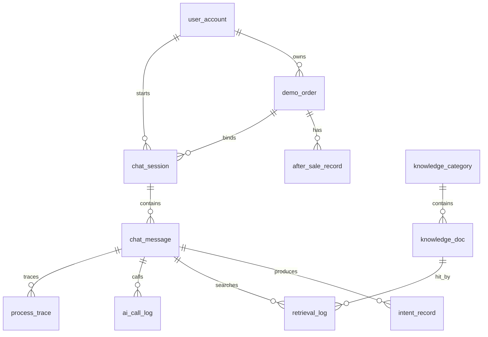

# 数据库设计说明书

## 1. 设计目标

本数据库用于支撑“基于检索增强的电商退换货智能客服系统”。系统的核心不是单纯保存聊天记录，而是要把售后业务、知识库检索、多轮会话、订单上下文和 AI 增强调用串成一条可追踪的业务链路。

数据库设计需要满足以下目标：

1. 支持退货、换货、退款、物流异常、规则咨询、投诉转人工等典型售后场景。
2. 支持知识库文档的维护、分类、检索和命中依据展示。
3. 支持多轮对话记录，能够保存用户问题、系统回复、意图识别结果和处理轨迹。
4. 支持订单上下文读取，让回复能够结合订单状态，而不是只做通用问答。
5. 支持 LangChain4j 调用日志记录，方便说明 AI 增强层是否参与、是否成功、是否触发兜底。
6. 表结构保持课程项目可实现的复杂度，不做过度企业化设计。

## 2. 设计原则

- 业务主线优先：围绕“用户提问 -> 意图识别 -> 查询订单 -> 检索知识 -> 生成回复 -> 记录日志”设计数据表。
- 核心数据结构化：订单、售后、知识文档、会话、消息、意图和调用日志都单独建表，避免全部塞进一个大 JSON 字段。
- AI 能力可追踪：AI 生成不是黑盒，数据库需要记录模型名称、调用状态、耗时、异常和回复摘要。
- 演示数据可控：订单和售后数据使用演示样例即可，但字段要贴近真实业务，方便答辩说明。
- 先满足单管理员：当前阶段不做复杂权限体系，只保留简单用户表和角色字段，为后续扩展留接口。
- 保留软删除和状态字段：知识文档、会话等数据不直接物理删除，便于恢复和审计。

## 3. 总体数据模型

核心关系说明：

- 一个用户可以拥有多个演示订单，也可以发起多个客服会话。
- 一个订单可以关联多个售后记录，例如先申请退货，再进入退款处理。
- 一个会话包含多条消息，消息按发送顺序保存。
- 一条用户消息可以产生意图识别记录、知识检索记录、AI 调用记录和处理轨迹。
- 知识文档归属于知识分类，检索命中时通过日志记录命中的文档和分数。

## 4. 表结构设计

### 4.1 用户表 `user_account`

用途：保存演示用户和管理员的基本信息。当前阶段可内置一个普通用户和一个管理员，主要用于关联订单、会话和知识文档维护人。

| 字段名 | 类型 | 约束 | 说明 |
| --- | --- | --- | --- |
| id | BIGINT | 主键，自增 | 用户 ID |
| username | VARCHAR(50) | 唯一，非空 | 登录名或演示用户名 |
| display_name | VARCHAR(80) | 非空 | 展示名称 |
| role | VARCHAR(20) | 非空 | `CUSTOMER`、`ADMIN` |
| phone | VARCHAR(20) | 可空 | 演示手机号 |
| status | TINYINT | 默认 1 | 1 启用，0 停用 |
| created_at | DATETIME | 非空 | 创建时间 |
| updated_at | DATETIME | 非空 | 更新时间 |

建议索引：

- `uk_user_username(username)`
- `idx_user_role(role)`

### 4.2 演示订单表 `demo_order`

用途：保存系统演示所需的订单上下文。客服回复需要根据订单状态、签收时间、物流状态和售后状态判断处理建议。

| 字段名 | 类型 | 约束 | 说明 |
| --- | --- | --- | --- |
| id | BIGINT | 主键，自增 | 订单 ID |
| order_no | VARCHAR(40) | 唯一，非空 | 订单号 |
| user_id | BIGINT | 外键，可空 | 所属用户 |
| product_name | VARCHAR(120) | 非空 | 商品名称 |
| sku_name | VARCHAR(120) | 可空 | 规格信息 |
| order_amount | DECIMAL(10,2) | 非空 | 订单金额 |
| pay_status | VARCHAR(20) | 非空 | 支付状态 |
| order_status | VARCHAR(30) | 非空 | 订单状态 |
| logistics_status | VARCHAR(30) | 非空 | 物流状态 |
| after_sale_status | VARCHAR(30) | 非空 | 售后状态 |
| paid_at | DATETIME | 可空 | 支付时间 |
| shipped_at | DATETIME | 可空 | 发货时间 |
| signed_at | DATETIME | 可空 | 签收时间 |
| created_at | DATETIME | 非空 | 创建时间 |
| updated_at | DATETIME | 非空 | 更新时间 |

建议枚举：

- `pay_status`：`UNPAID`、`PAID`、`REFUNDING`、`REFUNDED`
- `order_status`：`PENDING_PAY`、`PAID`、`SHIPPED`、`SIGNED`、`COMPLETED`、`CLOSED`
- `logistics_status`：`NOT_SHIPPED`、`IN_TRANSIT`、`DELIVERED`、`ABNORMAL`
- `after_sale_status`：`NONE`、`RETURN_APPLYING`、`RETURNING`、`EXCHANGE_APPLYING`、`REFUNDING`、`FINISHED`、`REJECTED`

建议索引：

- `uk_order_no(order_no)`
- `idx_order_user(user_id)`
- `idx_order_status(order_status, after_sale_status)`

### 4.3 售后记录表 `after_sale_record`

用途：保存订单对应的退货、换货、退款或投诉记录。它和订单表分开，是因为一个订单可能没有售后，也可能产生多条售后处理记录。

| 字段名 | 类型 | 约束 | 说明 |
| --- | --- | --- | --- |
| id | BIGINT | 主键，自增 | 售后记录 ID |
| after_sale_no | VARCHAR(40) | 唯一，非空 | 售后单号 |
| order_id | BIGINT | 外键，非空 | 关联订单 |
| service_type | VARCHAR(30) | 非空 | 售后类型 |
| reason | VARCHAR(200) | 可空 | 申请原因 |
| status | VARCHAR(30) | 非空 | 当前处理状态 |
| refund_amount | DECIMAL(10,2) | 可空 | 退款金额 |
| apply_at | DATETIME | 非空 | 申请时间 |
| handle_at | DATETIME | 可空 | 处理时间 |
| remark | VARCHAR(500) | 可空 | 备注 |
| created_at | DATETIME | 非空 | 创建时间 |
| updated_at | DATETIME | 非空 | 更新时间 |

建议枚举：

- `service_type`：`RETURN`、`EXCHANGE`、`REFUND`、`COMPLAINT`
- `status`：`APPLIED`、`APPROVED`、`REJECTED`、`WAIT_BUYER_SEND`、`WAIT_SELLER_CONFIRM`、`REFUNDING`、`FINISHED`

建议索引：

- `uk_after_sale_no(after_sale_no)`
- `idx_after_sale_order(order_id)`
- `idx_after_sale_status(status)`

### 4.4 知识分类表 `knowledge_category`

用途：保存知识文档分类，便于前端筛选和后端检索。分类不宜太细，先按售后业务场景划分。

| 字段名 | 类型 | 约束 | 说明 |
| --- | --- | --- | --- |
| id | BIGINT | 主键，自增 | 分类 ID |
| parent_id | BIGINT | 默认 0 | 父分类 ID，当前可统一为 0 |
| category_code | VARCHAR(50) | 唯一，非空 | 分类编码 |
| category_name | VARCHAR(80) | 非空 | 分类名称 |
| sort_order | INT | 默认 0 | 排序 |
| enabled | TINYINT | 默认 1 | 是否启用 |
| created_at | DATETIME | 非空 | 创建时间 |
| updated_at | DATETIME | 非空 | 更新时间 |

建议初始分类：

- `RETURN_RULE`：退货规则
- `EXCHANGE_RULE`：换货规则
- `REFUND_RULE`：退款规则
- `LOGISTICS_RULE`：物流异常
- `COMPLAINT_RULE`：投诉与人工转接
- `GENERAL_FAQ`：通用 FAQ

### 4.5 知识文档表 `knowledge_doc`

用途：保存 FAQ、平台规则、售后说明和话术模板，是知识库检索和回答依据展示的核心表。

| 字段名 | 类型 | 约束 | 说明 |
| --- | --- | --- | --- |
| id | BIGINT | 主键，自增 | 文档 ID |
| category_id | BIGINT | 外键，非空 | 所属分类 |
| title | VARCHAR(150) | 非空 | 文档标题 |
| doc_type | VARCHAR(30) | 非空 | 文档类型 |
| intent_code | VARCHAR(50) | 可空 | 适用意图 |
| scenario | VARCHAR(80) | 可空 | 适用场景 |
| question | VARCHAR(300) | 可空 | FAQ 问题 |
| answer | TEXT | 可空 | FAQ 答案 |
| content | TEXT | 非空 | 规则正文或完整知识内容 |
| keywords | VARCHAR(300) | 可空 | 关键词，逗号分隔 |
| priority | INT | 默认 0 | 检索和展示优先级 |
| status | VARCHAR(20) | 默认 `ENABLED` | 文档状态 |
| version_no | INT | 默认 1 | 文档版本 |
| created_by | BIGINT | 可空 | 创建人 |
| updated_by | BIGINT | 可空 | 更新人 |
| created_at | DATETIME | 非空 | 创建时间 |
| updated_at | DATETIME | 非空 | 更新时间 |
| deleted | TINYINT | 默认 0 | 软删除标记 |

建议枚举：

- `doc_type`：`FAQ`、`POLICY`、`SCRIPT`、`NOTICE`
- `status`：`ENABLED`、`DISABLED`

建议索引：

- `idx_doc_category(category_id)`
- `idx_doc_intent(intent_code)`
- `idx_doc_status(status, deleted)`
- `idx_doc_priority(priority)`
- 可增加 MySQL FULLTEXT 索引：`fulltext(title, question, content, keywords)`，用于基础全文检索。

### 4.6 会话表 `chat_session`

用途：保存一次客服咨询会话。会话可以绑定用户和订单，也可以在未提供订单号时先创建，后续再补充订单。

| 字段名 | 类型 | 约束 | 说明 |
| --- | --- | --- | --- |
| id | BIGINT | 主键，自增 | 会话 ID |
| session_no | VARCHAR(40) | 唯一，非空 | 会话编号，前端展示用 |
| user_id | BIGINT | 外键，可空 | 用户 ID |
| order_id | BIGINT | 外键，可空 | 当前绑定订单 |
| title | VARCHAR(120) | 可空 | 会话标题 |
| channel | VARCHAR(30) | 默认 `WEB` | 来源渠道 |
| status | VARCHAR(20) | 默认 `ACTIVE` | 会话状态 |
| current_intent | VARCHAR(50) | 可空 | 最近一次识别意图 |
| summary | VARCHAR(1000) | 可空 | 多轮上下文摘要 |
| created_at | DATETIME | 非空 | 创建时间 |
| updated_at | DATETIME | 非空 | 更新时间 |
| closed_at | DATETIME | 可空 | 关闭时间 |

建议枚举：

- `status`：`ACTIVE`、`CLOSED`
- `channel`：`WEB`、`ADMIN_TEST`

建议索引：

- `uk_session_no(session_no)`
- `idx_session_user(user_id)`
- `idx_session_order(order_id)`
- `idx_session_status(status, updated_at)`

### 4.7 消息表 `chat_message`

用途：保存用户消息、系统回复和必要的系统提示。每条消息都属于一个会话，用 `seq_no` 保证前端展示顺序。

| 字段名 | 类型 | 约束 | 说明 |
| --- | --- | --- | --- |
| id | BIGINT | 主键，自增 | 消息 ID |
| session_id | BIGINT | 外键，非空 | 所属会话 |
| role | VARCHAR(20) | 非空 | 消息角色 |
| content | TEXT | 非空 | 消息内容 |
| message_type | VARCHAR(30) | 默认 `TEXT` | 消息类型 |
| seq_no | INT | 非空 | 会话内消息顺序 |
| reply_to_id | BIGINT | 可空 | 回复的上一条消息 |
| intent_code | VARCHAR(50) | 可空 | 系统回复关联意图 |
| source_type | VARCHAR(30) | 可空 | 回复来源 |
| created_at | DATETIME | 非空 | 创建时间 |

建议枚举：

- `role`：`USER`、`ASSISTANT`、`SYSTEM`
- `message_type`：`TEXT`、`TIP`、`ERROR`
- `source_type`：`RULE_TEMPLATE`、`AI_ENHANCED`、`FALLBACK`

建议索引：

- `idx_message_session(session_id, seq_no)`
- `idx_message_created(created_at)`

### 4.8 意图识别记录表 `intent_record`

用途：保存每次用户消息的意图识别结果。单独建表可以让系统在答辩时展示识别过程和识别结果，而不只是展示最终回复。

| 字段名 | 类型 | 约束 | 说明 |
| --- | --- | --- | --- |
| id | BIGINT | 主键，自增 | 记录 ID |
| session_id | BIGINT | 外键，非空 | 所属会话 |
| message_id | BIGINT | 外键，非空 | 用户消息 ID |
| intent_code | VARCHAR(50) | 非空 | 意图编码 |
| intent_name | VARCHAR(80) | 非空 | 意图名称 |
| confidence | DECIMAL(5,4) | 可空 | 置信度 |
| method | VARCHAR(30) | 非空 | 识别方式 |
| slots_json | JSON | 可空 | 订单号、商品、时间等槽位信息 |
| created_at | DATETIME | 非空 | 创建时间 |

建议枚举：

- `intent_code`：`PRE_SALE`、`RETURN_APPLY`、`EXCHANGE_APPLY`、`REFUND_PROGRESS`、`LOGISTICS_QUERY`、`RULE_EXPLAIN`、`COMPLAINT_TRANSFER`
- `method`：`RULE`、`AI`、`HYBRID`

建议索引：

- `idx_intent_message(message_id)`
- `idx_intent_session(session_id)`
- `idx_intent_code(intent_code)`

### 4.9 知识检索日志表 `retrieval_log`

用途：记录用户问题命中了哪些知识文档。它既服务于前端“依据展示”，也服务于后续调试检索效果。

| 字段名 | 类型 | 约束 | 说明 |
| --- | --- | --- | --- |
| id | BIGINT | 主键，自增 | 日志 ID |
| session_id | BIGINT | 外键，非空 | 所属会话 |
| message_id | BIGINT | 外键，非空 | 用户消息 ID |
| query_text | VARCHAR(500) | 非空 | 检索问题 |
| doc_id | BIGINT | 外键，可空 | 命中文档 |
| rank_no | INT | 非空 | 命中排序 |
| score | DECIMAL(8,4) | 可空 | 匹配得分 |
| hit_reason | VARCHAR(300) | 可空 | 命中原因 |
| doc_title_snapshot | VARCHAR(150) | 可空 | 命中文档标题快照 |
| doc_content_snapshot | TEXT | 可空 | 命中文档内容快照 |
| created_at | DATETIME | 非空 | 创建时间 |

设计说明：

- 保存快照是为了避免知识文档后续修改后，历史会话依据发生变化。
- `doc_id` 可以为空，用于记录未命中的检索尝试。

建议索引：

- `idx_retrieval_message(message_id)`
- `idx_retrieval_doc(doc_id)`
- `idx_retrieval_created(created_at)`

### 4.10 AI 调用日志表 `ai_call_log`

用途：保存 LangChain4j 调用大模型的状态，支撑 AI 可用性判断、异常兜底说明和演示调试。

| 字段名 | 类型 | 约束 | 说明 |
| --- | --- | --- | --- |
| id | BIGINT | 主键，自增 | 日志 ID |
| session_id | BIGINT | 外键，非空 | 所属会话 |
| message_id | BIGINT | 外键，非空 | 用户消息 ID |
| provider | VARCHAR(50) | 可空 | 模型服务提供方 |
| model_name | VARCHAR(80) | 可空 | 模型名称 |
| request_summary | TEXT | 可空 | 请求摘要，不保存敏感密钥 |
| response_summary | TEXT | 可空 | 响应摘要 |
| status | VARCHAR(20) | 非空 | 调用状态 |
| prompt_tokens | INT | 可空 | 输入 token 数 |
| completion_tokens | INT | 可空 | 输出 token 数 |
| latency_ms | INT | 可空 | 调用耗时 |
| error_message | VARCHAR(1000) | 可空 | 异常摘要 |
| created_at | DATETIME | 非空 | 创建时间 |

建议枚举：

- `status`：`SUCCESS`、`FAILED`、`SKIPPED`

建议索引：

- `idx_ai_message(message_id)`
- `idx_ai_status(status, created_at)`

### 4.11 处理轨迹表 `process_trace`

用途：记录一次问题处理过程中的关键步骤，方便前端展示“系统如何得到这个回答”。这张表对课程答辩很有价值，因为它能说明系统不是只把问题丢给 AI。

| 字段名 | 类型 | 约束 | 说明 |
| --- | --- | --- | --- |
| id | BIGINT | 主键，自增 | 轨迹 ID |
| session_id | BIGINT | 外键，非空 | 所属会话 |
| message_id | BIGINT | 外键，非空 | 用户消息 ID |
| step_name | VARCHAR(50) | 非空 | 步骤名称 |
| step_status | VARCHAR(20) | 非空 | 步骤状态 |
| detail_json | JSON | 可空 | 步骤详情 |
| created_at | DATETIME | 非空 | 创建时间 |

建议步骤：

- `RECEIVE_MESSAGE`：接收用户消息
- `INTENT_RECOGNIZE`：识别售后意图
- `ORDER_CONTEXT`：读取订单上下文
- `KNOWLEDGE_RETRIEVAL`：检索知识库
- `RULE_DECISION`：执行业务规则判断
- `AI_GENERATION`：调用 LangChain4j 生成回复
- `FALLBACK_REPLY`：触发本地模板兜底
- `FINAL_REPLY`：返回最终回复

建议索引：

- `idx_trace_message(message_id)`
- `idx_trace_session(session_id, created_at)`

## 5. 字段命名与公共规范

公共字段：

- `id`：统一使用 BIGINT 自增主键。
- `created_at`：记录创建时间。
- `updated_at`：记录更新时间，除纯日志表外建议保留。
- `deleted`：需要软删除的业务表保留该字段，日志表不需要软删除。

命名规则：

- 表名使用小写下划线，例如 `chat_message`。
- 字段名使用小写下划线，例如 `order_no`。
- 状态字段使用英文枚举值，方便后端代码统一维护。
- 外键字段使用 `xxx_id` 命名，例如 `session_id`、`order_id`。

时间字段：

- 统一使用 `DATETIME`。
- 后端统一按北京时间写入，展示时前端直接格式化。

文本字段：

- 普通名称使用 `VARCHAR`。
- 文档正文、聊天内容、摘要使用 `TEXT`。
- 半结构化槽位和处理详情使用 `JSON`。

## 6. 初始化数据设计

为了保证演示稳定，数据库需要准备一批可控的初始数据。

用户数据：

- 普通演示用户：`demo_customer`
- 管理员用户：`admin`

订单样例：

- 已签收 3 天，可申请退货。
- 已签收 10 天，超过无理由退货期限。
- 退款处理中，适合查询退款进度。
- 物流异常，适合演示物流投诉和人工转接。
- 未发货订单，适合演示取消订单或售前咨询。

知识文档：

- 退货规则不少于 5 条。
- 换货规则不少于 5 条。
- 退款到账说明不少于 5 条。
- 物流异常处理不少于 5 条。
- 投诉与人工转接说明不少于 5 条。
- 通用 FAQ 和话术模板若干。

测试会话：

- 可以预置 2 到 3 组历史会话，用于展示多轮追问和上下文承接。

## 7. 典型数据流

用户发送“这个订单能不能退货”时：

1. `chat_session` 保存或读取当前会话。
2. `chat_message` 保存用户消息。
3. `intent_record` 保存识别结果，例如 `RETURN_APPLY`。
4. `demo_order` 读取订单状态和签收时间。
5. `knowledge_doc` 检索退货规则。
6. `retrieval_log` 保存命中文档及快照。
7. `process_trace` 保存每个处理步骤。
8. `ai_call_log` 记录 LangChain4j 是否参与生成。
9. `chat_message` 保存最终系统回复。

如果 AI 调用失败：

1. `ai_call_log.status` 写入 `FAILED`。
2. `process_trace` 增加 `FALLBACK_REPLY` 步骤。
3. `chat_message.source_type` 写入 `FALLBACK`。
4. 系统仍然返回基于规则和知识库的稳定回复。

## 8. 开发优先级

第一批必须完成：

- `demo_order`
- `knowledge_category`
- `knowledge_doc`
- `chat_session`
- `chat_message`

第二批完成业务可解释性：

- `intent_record`
- `retrieval_log`
- `process_trace`

第三批完成 AI 增强和展示：

- `ai_call_log`
- `after_sale_record`
- `user_account`

这样的顺序可以保证项目先跑通基础问答闭环，再逐步补充 AI 增强、售后细节和日志展示，不会一开始就被表结构拖住进度。

## 9. 后续 SQL 脚本安排

后续实现阶段建议在 `sql/` 目录下拆分两个脚本：

- `schema.sql`：保存所有建表语句、主键、唯一约束和索引。
- `seed.sql`：保存分类、知识文档、演示用户、演示订单和测试会话。

如果使用 MyBatis Plus，可以让实体类字段和本文档保持一致；如果使用 JPA，也应以本文档为准建立实体关系，避免后端代码和数据库说明不一致。

