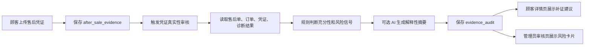

# AI 凭证真实性审核开发计划

## 1. 功能目标

本功能是六项售后增强计划中的第三项，目标是在顾客上传售后凭证后，系统对凭证做一次“充分性 + 真实性风险 + 补证建议”的审核，帮助顾客知道为什么还不能直接退款，也帮助管理员在审核页快速识别证据是否可信、是否需要补材料或人工复核。

第一版明确不做“100% AI 生图鉴定”，也不把隐藏水印、C2PA、EXIF、视觉异常当成自动退款或自动驳回依据。系统只输出风险信号和处理建议，最终业务动作仍由管理员在 Spring Boot 售后审核服务中执行。

第一版必须做到：

1. 顾客补充图片、视频、物流单号或文字说明后，可以触发凭证审核。
2. 后端保存审核编号、审核状态、充分性等级、真实性风险、疑似 AI 生成风险、篡改风险和补证建议。
3. 顾客售后详情页可以看到“当前凭证是否足够、还需补什么、为什么不能直接退款”。
4. 管理员审核页可以看到每条凭证的风险信号，并据此选择通过、补材料、驳回或转人工。
5. AI 不可用时仍使用本地规则输出可解释结果，且 `ai_status` 标记为 `SKIPPED` 或 `FAILED`。

## 2. 当前项目适配

当前项目已经具备售后申请、补充凭证、处理日志、前置诊断和管理员审核页，本功能不新建演示页，而是嵌入真实售后链路。

| 能力 | 现有位置 | 本功能改动 |
| --- | --- | --- |
| 顾客补充凭证 | `CustomerAfterSaleCenterView.vue`、`CustomerAfterSaleController`、`AfterSaleApplicationServiceImpl.addEvidence` | 提交凭证后支持触发审核，并在详情页展示审核结果 |
| 凭证表 | `after_sale_evidence` | 复用，不改变原凭证结构 |
| 管理员审核 | `AdminAfterSaleReviewView.vue`、`AdminAfterSaleController` | 新增凭证审核卡片和后台查询接口 |
| AI 兜底 | `AiService` + 本地规则 | 优先本地规则，可选 AI 解释，不让 AI 直接改状态 |
| 审计编号 | `NoUtils` | 新增 `evidenceAuditNo()` |

业务流：



## 3. 数据库设计

新增表 `evidence_audit`，与现有 `after_sale_evidence` 一对多。允许同一凭证被重新审核，前端默认展示最新一次，列表仍保留历史。

| 字段 | 类型 | 说明 |
| --- | --- | --- |
| `id` | BIGINT | 主键 |
| `audit_no` | VARCHAR(40) | 审核编号 |
| `application_id` | BIGINT | 售后申请 |
| `evidence_id` | BIGINT | 对应凭证 |
| `audit_status` | VARCHAR(30) | PASS / NEED_MORE / RISKY / MANUAL_REVIEW |
| `sufficiency_level` | VARCHAR(30) | SUFFICIENT / PARTIAL / INSUFFICIENT |
| `authenticity_risk` | VARCHAR(20) | LOW / MEDIUM / HIGH |
| `ai_generated_risk` | VARCHAR(20) | LOW / MEDIUM / HIGH |
| `tamper_risk` | VARCHAR(20) | LOW / MEDIUM / HIGH |
| `metadata_signal` | VARCHAR(1000) | EXIF、编辑软件、C2PA、来源说明等信号 |
| `visual_signal` | VARCHAR(1000) | 视觉一致性或异常说明 |
| `watermark_signal` | VARCHAR(1000) | 水印、平台来源、疑似生成来源说明 |
| `required_evidence` | VARCHAR(1000) | 建议补充凭证 |
| `audit_detail_json` | JSON | 结构化规则命中项 |
| `ai_summary` | VARCHAR(1000) | AI 或本地规则说明 |
| `ai_status` | VARCHAR(20) | SUCCESS / FAILED / SKIPPED |
| `ai_error_message` | VARCHAR(1000) | AI 错误或跳过说明 |
| `created_at` | DATETIME | 创建时间 |

迁移要求：

- `schema.sql` 使用 `CREATE TABLE IF NOT EXISTS`，不破坏已有数据库。
- 对 `application_id`、`evidence_id`、`audit_status`、`created_at` 建索引，方便管理员按售后单加载。
- 不改动 `after_sale_evidence` 字段，避免影响已有补证链路。

## 4. 后端设计

### 4.1 POJO 与 Mapper

新增：

- `EvidenceAudit`
- `EvidenceAuditMapper`
- `EvidenceAuditMapper.xml`
- `EvidenceAuditService`
- `EvidenceAuditServiceImpl`
- `EvidenceAuditController`

`AfterSaleEvidence` 增加非表字段 `latestAudit`，用于售后详情返回时直接携带最新审核结果。

### 4.2 REST 接口

```http
POST /after-sale-evidences/{id}/audits
GET  /after-sale-evidences/{id}/audits
GET  /admin/after-sales/{id}/evidence-audits
```

接口规则：

- 顾客只能审核和查看自己售后单下的凭证。
- 管理员可以审核和查看任意售后凭证。
- `POST` 不直接改变售后单状态，只写入 `evidence_audit` 和处理日志。
- `GET /admin/after-sales/{id}/evidence-audits` 按售后单返回所有凭证审核结果，供审核页集中展示。

### 4.3 本地规则策略

第一版以本地规则为主，避免对 AI 图片水印能力过度包装。

| 维度 | 判断示例 |
| --- | --- |
| 充分性 | 图片/视频/物流单号是否与售后类型和问题描述匹配；内容是否太短；是否有故障现象说明 |
| 真实性风险 | 链接或内容出现 `ai-generated`、`midjourney`、`stable-diffusion`、`dream`、`编辑软件`、`二次处理` 等信号 |
| 疑似 AI 生成风险 | 内容出现“AI 生成”“无原图”“生成图”“水印缺失”“合成感”等词，或图片链接包含生成平台痕迹 |
| 篡改风险 | 出现“P 图”“PS”“裁剪”“修改时间”“截图转发”等信号 |
| 元数据/水印 | 第一版从 `file_url` 和 `content` 的用户描述中抽取来源信号，不伪造真实 EXIF 检测能力 |

输出建议：

- `PASS`：凭证充分且风险低，建议管理员结合订单规则审核。
- `NEED_MORE`：材料不足或缺关键证据，建议补充故障视频、商品外观照、物流截图、序列号等。
- `RISKY`：疑似 AI 生成、篡改或来源不清，建议人工复核并补原始凭证。
- `MANUAL_REVIEW`：高风险或高金额/投诉类场景，建议转人工复核。

### 4.4 AI 调用边界

可选 AI 只负责把规则结果整理成更自然的客服说明：

- 不让 AI 判断“必假”“必真”。
- 不让 AI 生成自动退款/驳回结论。
- AI 失败时保留本地规则结果，`ai_status` 为 `FAILED`。
- 前端文案使用“疑似”“风险信号”“建议补证”，不使用“鉴定为假图”等绝对话术。

## 5. 前端设计

新增组件：

- `web/src/components/after-sale/EvidenceAuditPanel.vue`

顾客售后详情：

- 凭证材料列表中展示最新审核结果。
- 每条凭证提供“审核凭证”按钮。
- 审核结果显示充分性、风险等级、补证建议和解释说明。

管理员审核页：

- 在审核动作前增加“凭证真实性审核”区域。
- 展示每条凭证的审核状态、真实性风险、AI 生成风险、篡改风险、元数据信号、视觉信号、水印信号。
- 提供“重新审核”按钮，便于演示同一凭证被复核。

`StatusTag.vue` 需要补充标签：

- `PASS`、`NEED_MORE`、`RISKY`
- `SUFFICIENT`、`PARTIAL`、`INSUFFICIENT`
- `MEDIUM`
- `IMAGE`、`VIDEO`、`TEXT`、`LOGISTICS_NO`

## 6. 验收标准

1. 执行 `sql/schema.sql` 后，`evidence_audit` 表可访问。
2. 顾客补充凭证后，调用审核接口能生成审核记录。
3. 顾客售后详情页能看到凭证审核状态和补证建议。
4. 管理员审核页能看到全部凭证审核结果，并能重新审核。
5. 审核结果不会自动通过、驳回或退款，只作为客服判断依据。
6. `mvn -q -DskipTests package` 通过。
7. `npm run build` 通过。
8. 接口冒烟和浏览器冒烟通过。

## 7. 自审与修订

### 7.1 初稿风险

1. 如果文案写成“AI 判断是否 AI 生成的坏产品”，容易被老师追问模型依据，也容易显得不真实。
2. 如果审核后自动修改售后状态，会破坏现有“管理员审核才改状态”的真实业务边界。
3. 如果宣称读取隐藏水印、C2PA、EXIF，但第一版没有真实文件解析，会变成演示痕迹。
4. 如果只做管理员端，顾客不知道为什么不能直接退款，功能闭环不完整。

### 7.2 修订结果

1. 统一改成“凭证真实性风险审核”，强调风险信号而不是绝对鉴伪。
2. 第一版只从凭证类型、文字说明、链接来源和售后上下文做规则判断，不伪装真实 EXIF/C2PA 检测。
3. 审核结果只写 `evidence_audit` 和处理日志，不直接改售后申请状态。
4. 顾客端和管理员端都展示审核结果：顾客看补证理由，管理员看风险详情。
5. 保留 AI 解释层，但本地规则必须完整可用，符合 Spring Boot + Vue 3 + MySQL + LangChain4j 的项目约束。

自审结论：计划可以实施。它既保留“AI 凭证审核”的亮点，又把能力边界讲清楚，更接近真实平台的风控辅助功能。
