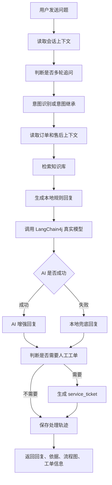

# 高分增强功能设计文档

## 1. 文档目的

本文档用于规划四个面向结项答辩的增强功能：

1. 演示数据统一
2. 多轮追问优化
3. 回答过程可视化
4. 人工客服工单转接

这四项的目标不是简单堆功能，而是让系统更符合“复杂软件系统实践”的评分关注点：业务链路完整、演示稳定、逻辑清楚、界面友好、技术亮点可解释。

## 2. 当前系统基础

当前系统已经具备以下基础能力：

| 能力 | 当前状态 | 可复用内容 |
| --- | --- | --- |
| 会话管理 | 已实现 | `chat_session`、`chat_message`、`/chat-sessions` |
| 意图识别 | 已实现规则识别 | `intent_record`、`ChatServiceImpl.recognizeIntent` |
| 知识库检索 | 已实现 | `knowledge_doc`、`retrieval_log`、`/knowledge-docs/search` |
| 订单上下文 | 已实现 | `demo_order`、`after_sale_record`、`/orders` |
| AI 增强 | 已接入 LangChain4j | `AiService`、`ai_call_log` |
| 处理轨迹 | 已记录基础步骤 | `process_trace`、`/chat-sessions/{id}/process-traces` |
| 前端工作台 | 已实现 | `ChatWorkbenchView.vue` 右侧洞察面板 |

因此增强设计应尽量复用现有数据表和接口，少做大拆大改。

## 3. 增强目标总览

| 增强项 | 答辩价值 | 实现难度 | 优先级 |
| --- | --- | --- | --- |
| 演示数据统一 | 降低现场翻车风险，演示更连贯 | 低 | P0 |
| 多轮追问优化 | 正面回应任务书“多轮对话”要求 | 中 | P0 |
| 回答过程可视化 | 让老师看到系统处理链路，不像套壳聊天框 | 中 | P0 |
| 人工客服工单转接 | 把问答系统升级成业务系统，效果明显 | 中 | P1 |

建议实现顺序：

```text
演示数据统一 -> 多轮追问优化 -> 回答过程可视化 -> 人工客服工单转接
```

## 4. 演示数据统一

### 4.1 问题说明

当前文档和数据库中存在演示数据不一致：

| 位置 | 当前内容 |
| --- | --- |
| `docs/demo-script.md` | `YT20260415001`、`AirTune 蓝牙耳机` |
| `sql/seed.sql` | `DD202604290001`、`无线蓝牙耳机` |
| 前端默认订单 | `DD202604290001` |

如果答辩时按照文档输入 `YT20260415001`，系统查不到订单，会削弱演示效果。

### 4.2 统一方案

统一使用 `DD202604290001` 到 `DD202604290004` 四个演示订单。

| 场景 | 订单号 | 商品 | 订单状态 | 物流状态 | 售后状态 | 主要问题 |
| --- | --- | --- | --- | --- | --- | --- |
| 可退货 | `DD202604290001` | 无线蓝牙耳机 | `SIGNED` | `DELIVERED` | `NONE` | 这个订单能不能退货？ |
| 超期或特殊判断 | `DD202604290002` | 智能手表 | `SIGNED` | `DELIVERED` | `NONE` | 这个订单还能退吗？ |
| 退款中 | `DD202604290003` | 机械键盘 | `COMPLETED` | `DELIVERED` | `REFUNDING` | 退款多久到账？ |
| 物流异常 | `DD202604290004` | 移动电源 | `SHIPPED` | `ABNORMAL` | `NONE` | 物流一直不更新怎么办？ |

### 4.3 需要调整的文档

需要同步修改：

- `docs/demo-script.md`
- `docs/test-cases.md`
- `docs/frontend-project-doc.md` 中的演示数据表
- README 中的示例订单号如果有新增示例

### 4.4 推荐演示流程

```text
1. 打开咨询工作台，默认绑定 DD202604290001。
2. 输入：这个订单能不能退货？
3. 追问：那退款多久到账？
4. 切换订单 DD202604290004。
5. 输入：物流一直不更新怎么办？
6. 输入：我要投诉，商家一直不处理。
7. 展示系统自动生成人工客服工单。
```

### 4.5 验收点

- 前端默认订单号、演示脚本、种子数据保持一致。
- 四个订单覆盖退货、退款、物流异常、投诉转人工。
- 每个订单都能在订单管理页查到。
- 聊天工作台绑定订单后，右侧订单上下文能正确展示。

## 5. 多轮追问优化

### 5.1 目标

让系统能处理省略式追问，例如：

```text
用户：这个订单能不能退货？
系统：可以申请退货...
用户：那多久到账？
系统：这里的“那”应理解为退货后的退款到账时间。
```

当前系统保存了历史消息，但意图识别主要依赖当前消息关键词。优化后应能利用上一轮意图、订单号、会话摘要和最近消息。

### 5.2 设计原则

1. 业务稳定优先：订单号、售后状态、规则判断仍由后端控制。
2. AI 作为增强层：模型辅助理解追问语义，但不能替代核心业务判断。
3. 兜底可用：即使 AI 失败，也能通过规则和最近意图完成基本承接。

### 5.3 会话上下文结构

优先复用 `chat_session.summary`，同时在服务层构造一个 `ConversationContext` 对象，不一定第一阶段新建表。

推荐结构：

```java
public class ConversationContext {
    private Long sessionId;
    private String orderNo;
    private String lastIntentCode;
    private String lastUserMessage;
    private String lastAssistantMessage;
    private String summary;
    private List<ChatMessage> recentMessages;
}
```

### 5.4 意图继承规则

当用户当前问题较短或包含指代词时，启用多轮追问判断。

触发条件：

| 条件 | 示例 |
| --- | --- |
| 包含指代词 | 那、这个、上面、刚才、继续、然后呢 |
| 问题较短 | 怎么办、多久到账、可以吗、需要多久 |
| 缺少明确业务词 | 未直接出现退货、退款、物流、投诉等关键词 |

继承策略：

| 上一轮意图 | 当前追问 | 识别结果 |
| --- | --- | --- |
| `RETURN_APPLY` | 那多久到账？ | `REFUND_PROGRESS` |
| `RETURN_APPLY` | 那现在怎么办？ | `RETURN_APPLY` |
| `EXCHANGE_APPLY` | 需要什么材料？ | `EXCHANGE_APPLY` |
| `LOGISTICS_QUERY` | 还是不动怎么办？ | `LOGISTICS_QUERY` 或 `COMPLAINT_TRANSFER` |
| `COMPLAINT_TRANSFER` | 多久有人处理？ | `COMPLAINT_TRANSFER` |

### 5.5 AI Prompt 增强

当前 AI Prompt 应加入最近上下文：

```text
你是电商退换货客服系统的回复增强器。

会话摘要：
{summary}

最近对话：
用户：这个订单能不能退货？
助手：该订单已签收，通常可以申请退货...
用户：那多久到账？

当前识别意图：
REFUND_PROGRESS / 退款进度

订单上下文：
{orderContext}

知识库命中：
{knowledgeHits}

本地规则回复：
{localReply}

请基于订单状态和知识依据生成客服回复，不要编造平台规则。
```

### 5.6 后端流程调整

现有流程：

```text
用户消息 -> 意图识别 -> 订单上下文 -> 知识检索 -> 本地回复 -> AI 增强 -> 保存消息和日志
```

优化后流程：

```text
用户消息
-> 读取会话上下文
-> 判断是否追问
-> 意图识别或意图继承
-> 订单上下文
-> 查询最近消息和会话摘要
-> 知识检索
-> 本地回复
-> AI 增强
-> 更新会话摘要
-> 保存消息、日志、轨迹
```

### 5.7 接口变化

聊天接口路径不变：

```http
POST /chat-sessions/{id}/messages
```

响应中建议新增：

```json
{
  "context": {
    "followUp": true,
    "inheritedIntent": "RETURN_APPLY",
    "resolvedIntent": "REFUND_PROGRESS",
    "summary": "用户正在咨询订单 DD202604290001 的退货和退款问题。"
  }
}
```

### 5.8 前端展示

在右侧洞察面板新增“上下文承接”区域：

| 字段 | 展示 |
| --- | --- |
| 是否追问 | 是 / 否 |
| 承接来源 | 上一轮意图、上一轮订单 |
| 解析结果 | 当前问题被理解为退款进度 / 物流异常等 |
| 会话摘要 | 一句话概括当前会话 |

### 5.9 测试用例

| 步骤 | 用户输入 | 期望 |
| --- | --- | --- |
| 1 | 这个订单能不能退货？ | `RETURN_APPLY` |
| 2 | 那多久到账？ | `REFUND_PROGRESS`，`followUp=true` |
| 3 | 那需要我寄回去吗？ | `RETURN_APPLY` 或售后处理说明 |
| 4 | 如果商家不处理呢？ | `COMPLAINT_TRANSFER` |

## 6. 回答过程可视化

### 6.1 目标

把系统内部处理过程可视化，让老师直观看到：

```text
不是用户问题直接丢给大模型，而是经过意图识别、订单读取、知识检索、AI 增强和兜底判断。
```

### 6.2 数据来源

主要复用已有 `process_trace` 表。

当前步骤：

- `INTENT_RECOGNIZE`
- `ORDER_CONTEXT`
- `KNOWLEDGE_RETRIEVAL`
- `AI_GENERATION`
- `FINAL_REPLY`

建议补充步骤：

- `CONTEXT_RESOLVE`：多轮上下文解析
- `HUMAN_TICKET_CHECK`：判断是否需要转人工
- `TICKET_CREATED`：生成工单

### 6.3 `detail_json` 规范

建议统一 `process_trace.detail_json`：

```json
{
  "title": "意图识别",
  "summary": "识别为退货申请",
  "input": "这个订单能不能退货？",
  "output": "RETURN_APPLY",
  "confidence": 0.92,
  "elapsedMs": 12,
  "extra": {
    "method": "RULE_WITH_CONTEXT"
  }
}
```

不同步骤的关键字段：

| 步骤 | 关键字段 |
| --- | --- |
| `CONTEXT_RESOLVE` | `followUp`、`lastIntent`、`resolvedIntent` |
| `INTENT_RECOGNIZE` | `intentCode`、`intentName`、`confidence`、`method` |
| `ORDER_CONTEXT` | `orderNo`、`orderStatus`、`afterSaleStatus` |
| `KNOWLEDGE_RETRIEVAL` | `hitCount`、`topDocTitle`、`keywords` |
| `AI_GENERATION` | `provider`、`modelName`、`status`、`latencyMs` |
| `FINAL_REPLY` | `sourceType`、`fallbackUsed` |
| `TICKET_CREATED` | `ticketNo`、`priority`、`status` |

### 6.4 前端组件设计

新增或增强组件：

```text
web/src/components/chat/ProcessFlowPanel.vue
```

布局建议：

```text
处理流程
[1] 上下文解析  成功  6ms
[2] 意图识别    成功  RETURN_APPLY / 0.92
[3] 订单读取    成功  DD202604290001 / 已签收
[4] 知识检索    成功  命中 3 条
[5] AI 生成     成功  gpt-4o-mini / 2991ms
[6] 最终回复    成功  AI 增强
```

交互：

- 默认显示简洁步骤条。
- 点击某一步展开详情。
- 失败步骤红色，跳过步骤灰色，成功步骤绿色。
- AI 生成步骤显示模型名和耗时。
- 知识检索步骤显示命中文档标题。

### 6.5 答辩讲法

可以这样讲：

```text
右侧不是普通日志，而是本次回复的可解释处理链路。
系统先解析多轮上下文，再识别意图，然后读取订单状态和售后状态，
接着检索领域知识库，最后才调用大模型组织自然语言回复。
如果模型失败，系统仍会返回本地规则兜底回复，并把失败记录到 AI 调用日志。
```

### 6.6 验收点

- 每次发送消息后，右侧流程图自动刷新。
- 至少显示 5 个核心步骤。
- 每个步骤有状态、摘要和详情。
- AI 成功、AI 失败、本地兜底都能在流程图中区分。

## 7. 人工客服工单转接

### 7.1 目标

当用户表达投诉、人工介入、商家不处理等诉求时，系统自动生成客服工单。这样项目从“问答系统”升级为“售后业务处理系统”。

触发示例：

```text
用户：商家一直不处理，我要投诉。
系统：已为你生成人工客服工单，工单号 T202604300001，客服会根据订单和对话记录继续处理。
```

### 7.2 触发条件

自动触发：

| 条件 | 说明 |
| --- | --- |
| 意图为 `COMPLAINT_TRANSFER` | 用户明确投诉或转人工 |
| 物流异常多轮追问 | 物流问题持续未解决 |
| 售后超时 | 商家长时间未处理 |
| 用户情绪强烈 | 包含“投诉”“人工”“不处理”“生气”等词 |

手动触发：

- 前端在咨询工作台提供“生成工单”按钮。
- 用户或演示人员点击后，后端根据当前会话生成工单。

### 7.3 新增数据表

建议新增 `service_ticket` 表：

```sql
CREATE TABLE service_ticket (
    id BIGINT PRIMARY KEY AUTO_INCREMENT,
    ticket_no VARCHAR(40) NOT NULL UNIQUE COMMENT '工单号',
    session_id BIGINT NOT NULL COMMENT '来源会话 ID',
    order_id BIGINT NULL COMMENT '关联订单 ID',
    user_id BIGINT NULL COMMENT '用户 ID',
    intent_code VARCHAR(50) NULL COMMENT '触发意图',
    priority VARCHAR(20) NOT NULL DEFAULT 'NORMAL' COMMENT 'LOW/NORMAL/HIGH/URGENT',
    status VARCHAR(30) NOT NULL DEFAULT 'PENDING' COMMENT 'PENDING/PROCESSING/RESOLVED/CLOSED',
    customer_issue VARCHAR(1000) NOT NULL COMMENT '用户问题摘要',
    ai_summary VARCHAR(2000) NULL COMMENT 'AI 或系统生成的会话摘要',
    suggested_action VARCHAR(1000) NULL COMMENT '建议处理动作',
    assigned_to VARCHAR(80) NULL COMMENT '模拟客服人员',
    created_at DATETIME NOT NULL DEFAULT CURRENT_TIMESTAMP,
    updated_at DATETIME NOT NULL DEFAULT CURRENT_TIMESTAMP ON UPDATE CURRENT_TIMESTAMP,
    resolved_at DATETIME NULL,
    deleted TINYINT NOT NULL DEFAULT 0,
    INDEX idx_ticket_session(session_id),
    INDEX idx_ticket_order(order_id),
    INDEX idx_ticket_status(status, created_at)
) COMMENT='人工客服工单表';
```

### 7.4 工单状态

| 状态 | 文案 | 说明 |
| --- | --- | --- |
| `PENDING` | 待处理 | 自动生成后等待客服处理 |
| `PROCESSING` | 处理中 | 模拟客服已接手 |
| `RESOLVED` | 已解决 | 问题已处理 |
| `CLOSED` | 已关闭 | 用户确认或工单关闭 |

优先级：

| 优先级 | 条件 |
| --- | --- |
| `LOW` | 一般咨询转人工 |
| `NORMAL` | 售后处理咨询 |
| `HIGH` | 投诉、商家超时不处理 |
| `URGENT` | 丢件、金额较高、强烈投诉 |

### 7.5 后端接口设计

新增资源：

```http
GET    /service-tickets
POST   /service-tickets
GET    /service-tickets/{id}
PUT    /service-tickets/{id}
DELETE /service-tickets/{id}
POST   /chat-sessions/{id}/service-tickets
GET    /chat-sessions/{id}/service-tickets
```

#### 7.5.1 从会话生成工单

```http
POST /chat-sessions/{id}/service-tickets
```

请求体：

```json
{
  "priority": "HIGH",
  "customerIssue": "商家一直不处理退货申请，用户要求投诉。",
  "assignedTo": "模拟客服A"
}
```

返回：

```json
{
  "code": 1,
  "msg": "success",
  "data": {
    "id": 1,
    "ticketNo": "T202604300001",
    "sessionId": 10,
    "orderNo": "DD202604290001",
    "intentCode": "COMPLAINT_TRANSFER",
    "priority": "HIGH",
    "status": "PENDING",
    "customerIssue": "商家一直不处理退货申请，用户要求投诉。",
    "aiSummary": "用户咨询退货后商家未处理，并要求平台介入。",
    "suggestedAction": "建议客服核查订单售后状态，联系商家处理，必要时升级平台介入。"
  }
}
```

#### 7.5.2 工单分页

```http
GET /service-tickets?page=1&pageSize=10&status=PENDING&keyword=投诉
```

#### 7.5.3 更新工单状态

```http
PUT /service-tickets/{id}
```

请求体：

```json
{
  "status": "PROCESSING",
  "assignedTo": "模拟客服A",
  "suggestedAction": "已联系商家，要求 24 小时内处理。"
}
```

### 7.6 聊天接口响应扩展

当系统自动生成工单时，`POST /chat-sessions/{id}/messages` 响应中增加：

```json
{
  "ticket": {
    "created": true,
    "ticketNo": "T202604300001",
    "priority": "HIGH",
    "status": "PENDING"
  }
}
```

如果未触发：

```json
{
  "ticket": {
    "created": false,
    "reason": "当前意图不需要人工转接"
  }
}
```

### 7.7 前端页面设计

#### 7.7.1 咨询工作台

在右侧洞察面板新增“人工工单”区域：

```text
人工工单
状态：已生成
工单号：T202604300001
优先级：HIGH
处理状态：待处理
[查看工单] [手动生成]
```

当识别为 `COMPLAINT_TRANSFER` 时：

- 自动显示工单生成结果。
- 助手回复中提示工单号。
- 处理流程中新增 `TICKET_CREATED` 步骤。

#### 7.7.2 工单管理页

可新增页面：

```text
/service-tickets
```

页面功能：

- 按状态、优先级、关键词筛选。
- 表格展示工单号、订单号、问题摘要、优先级、状态、创建时间。
- 点击查看工单详情。
- 支持更新状态为处理中、已解决、已关闭。

如果时间不够，可以先不新增独立菜单，只在日志中心或咨询工作台内展示最近工单。

### 7.8 工单生成规则

建议第一版使用规则生成，稳定可控：

```text
if intentCode == COMPLAINT_TRANSFER:
    priority = HIGH
elif logisticsStatus == ABNORMAL and user asks complaint:
    priority = HIGH
else:
    priority = NORMAL
```

`customerIssue` 来源：

- 当前用户消息
- 最近 3 轮对话摘要
- 订单号和售后状态

`suggestedAction` 来源：

- 意图类型
- 订单状态
- 知识库命中
- 本地规则模板

### 7.9 验收点

- 输入“商家一直不处理可以投诉吗？”后自动生成工单。
- 工单包含订单号、会话 ID、问题摘要、优先级和建议动作。
- 工单能在前端查看。
- 流程图中出现 `TICKET_CREATED`。
- 工单状态可修改。

## 8. 四项功能整合后的聊天主流程



## 9. 数据库变更汇总

### 9.1 必须变更

| 表 | 变更 |
| --- | --- |
| `service_ticket` | 新增人工工单表 |

### 9.2 建议变更

| 表 | 变更 |
| --- | --- |
| `process_trace` | 统一 `detail_json` 格式，写入耗时和摘要 |
| `chat_session` | 继续使用 `summary` 保存会话摘要 |
| `chat_message` | 可选增加 `context_snapshot`，保存当轮上下文快照 |

第一阶段不建议大改旧表，只新增 `service_ticket`，其余通过服务层对象和 `detail_json` 完成。

## 10. 后端改动清单

| 模块 | 改动 |
| --- | --- |
| `sql/schema.sql` | 新增 `service_ticket` 表 |
| `sql/seed.sql` | 统一四个演示订单和售后记录 |
| `ChatServiceImpl` | 增加上下文读取、追问识别、摘要更新、工单触发 |
| `ProcessTraceMapper` | 继续复用，写入更规范的 `detail_json` |
| `ServiceTicketController` | 新增工单 RESTful 接口 |
| `ServiceTicketService` | 新增工单生成、分页、更新状态 |
| `ServiceTicketMapper` | 新增工单 SQL |
| `AiServiceImpl` | Prompt 增加会话上下文，不改变模型调用封装 |

## 11. 前端改动清单

| 模块 | 改动 |
| --- | --- |
| `ChatWorkbenchView.vue` | 右侧增加上下文承接、流程图、工单区域 |
| `chatStore.js` | 保存 `context`、`trace`、`ticket` |
| `ProcessFlowPanel.vue` | 新增流程可视化组件 |
| `TicketPanel.vue` | 新增工单展示组件 |
| `serviceTicketApi.js` | 新增工单 API 封装 |
| `ServiceTicketView.vue` | 可选新增工单管理页 |
| `AppSidebar.vue` | 可选新增“工单管理”菜单 |

## 12. 测试计划

### 12.1 演示数据测试

| 用例 | 输入 | 期望 |
| --- | --- | --- |
| 订单 1 | `DD202604290001` | 可查询，状态为已签收 |
| 订单 3 | `DD202604290003` | 可查询，售后状态为退款中 |
| 订单 4 | `DD202604290004` | 可查询，物流状态异常 |

### 12.2 多轮追问测试

| 步骤 | 输入 | 期望 |
| --- | --- | --- |
| 1 | 这个订单能不能退货？ | `RETURN_APPLY` |
| 2 | 那多久到账？ | `REFUND_PROGRESS`，显示上下文承接 |
| 3 | 如果商家不处理呢？ | `COMPLAINT_TRANSFER` |

### 12.3 流程可视化测试

| 场景 | 期望步骤 |
| --- | --- |
| 普通 AI 回复 | 上下文解析、意图识别、订单读取、知识检索、AI 生成、最终回复 |
| AI 失败 | AI 生成失败、最终回复为本地兜底 |
| 投诉转人工 | 出现工单判断和工单生成步骤 |

### 12.4 工单测试

| 输入 | 期望 |
| --- | --- |
| 商家一直不处理可以投诉吗？ | 自动生成 `HIGH` 优先级工单 |
| 手动点击生成工单 | 返回工单号 |
| 修改工单状态为处理中 | 工单列表状态刷新 |

## 13. 答辩展示话术

可以按这个顺序讲：

```text
第一步，我先绑定一个演示订单，系统会读取订单状态和售后状态。
第二步，用户提出退货问题，系统不是直接调用大模型，而是先做意图识别。
第三步，系统根据意图检索知识库，右侧能看到命中的规则依据。
第四步，系统把订单上下文、知识依据和本地规则回复交给 LangChain4j 调用真实模型增强表达。
第五步，如果用户继续追问“那多久到账”，系统会承接上一轮退货语境，把它识别为退款进度问题。
第六步，如果用户要求投诉或转人工，系统会自动生成客服工单，形成从智能问答到人工处理的业务闭环。
```

## 14. 预期得分帮助

| 评分点 | 增强后的支撑 |
| --- | --- |
| 功能完整 | 问答、订单、知识库、日志、工单闭环 |
| UI 友好 | 处理流程可视化，信息更清晰 |
| 讲解逻辑 | 可按处理链路一步步展示 |
| 技术理解 | 能说明 AI 增强层和业务规则层的边界 |
| 拓展性 | 工单和上下文机制体现后续可扩展 |

## 15. 最小落地版本

如果时间有限，建议最小版本只做以下内容：

1. 统一演示数据和演示文档。
2. 在聊天响应中返回 `context.followUp`、`context.resolvedIntent`。
3. 把已有 `process_trace` 做成前端流程步骤条。
4. 新增 `service_ticket` 表和从会话生成工单接口。
5. 工作台右侧展示工单号，不单独做完整工单管理页。

这个版本已经足够在答辩时形成明显亮点。

