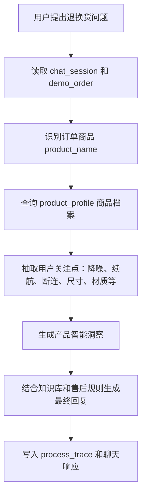

# 产品智能顾问功能详细开发计划

## 1. 文档目标

本文档用于单独规划六项增强功能中的第一项：产品智能顾问。

它要解决老师提出的核心问题：

```text
用户在退换货时，能否先了解这个产品的数据、特点和同类对比？
例如用户想退一个蓝牙耳机，客服能否智能说明这个产品的参数、适用场景、常见问题和排查建议。
```

本功能不是新增一个普通商品详情页，也不是让 AI 随便夸产品，而是让当前系统在售后咨询过程中自动读取订单商品、商品档案、知识库和本地规则，生成一份可解释的产品售后顾问结果。

最终效果应是：用户提出“我想退这个蓝牙耳机，降噪不明显”时，系统不仅回答能否退货，还能说明：

- 这是什么类型的耳机。
- 它有哪些核心参数和卖点。
- 用户反馈的问题可能和哪些使用条件有关。
- 有哪些排查步骤。
- 和同类产品相比它的定位如何。
- 当前更适合继续排查、退货、换货还是转人工。

## 2. 功能定位

产品智能顾问是售后前的商品理解层。

它放在现有聊天链路中，位于“订单上下文”和“售后规则判断”之间：



它不替代现有的退货、换货、退款、投诉判断。退款、驳回、售后状态流转仍然由 Spring Boot 服务层和管理员控制。

## 3. 当前项目可复用基础

当前项目已经具备产品智能顾问所需的大部分骨架。

| 已有能力 | 当前实现 | 本功能复用方式 |
| --- | --- | --- |
| 订单上下文 | `demo_order`、`DemoOrderMapper`、`OrderController` | 通过 `order_no` 或 `order_id` 读取商品名、SKU、订单状态 |
| 聊天主流程 | `ChatServiceImpl.sendMessage` | 在聊天响应中增加 `productInsight` |
| 知识检索 | `knowledge_doc`、`KnowledgeDocMapper.search` | 继续提供售后规则依据，不把商品档案塞进知识库替代业务表 |
| AI 增强 | `AiServiceImpl`、`AiBusinessToolServiceImpl` | 把产品档案作为模型上下文，AI 只负责组织表达 |
| 处理轨迹 | `process_trace`、`ProcessFlowPanel.vue` | 新增商品档案查询和产品洞察生成步骤 |
| 前端洞察面板 | `ChatWorkbenchView.vue` 右侧“处理洞察” | 增加“产品智能顾问”卡片 |
| 认证和权限 | `AuthService`、`AuthInterceptor`、`@OperatorAnno` | 用户只能查看自己订单的产品洞察，管理员可维护商品档案 |

因此本功能应保持现有 Spring Boot + Vue 3 + MySQL + LangChain4j 结构，不单独引入新的 AI 服务或独立前端页面作为主入口。

## 4. 功能边界

### 4.1 做什么

第一版必须完成：

1. 新增商品档案表 `product_profile`。
2. 为现有演示商品准备档案数据。
3. 提供根据订单查询产品洞察的接口。
4. 聊天时自动生成 `productInsight`。
5. 右侧洞察面板展示产品定位、参数、常见问题、排查建议、同类对比和售后建议。
6. LangChain4j Prompt 中引用产品洞察，但保留本地规则兜底。
7. 在 `process_trace` 中记录产品档案查询和产品洞察生成证据。

### 4.2 不做什么

第一版不做这些复杂事项：

1. 不接入真实电商商品库。
2. 不做价格全网比价。
3. 不做自动推荐新商品购买。
4. 不让 AI 决定退款、驳回或改售后状态。
5. 不承诺产品一定没有问题，只提供基于档案和规则的说明。
6. 不新增独立大而全的“商城商品管理系统”。

## 5. 业务场景

### 5.1 蓝牙耳机退货咨询

订单：`DD202604290001`

商品：`无线蓝牙耳机`

用户输入：

```text
我想退这个蓝牙耳机，降噪感觉没有宣传那么好
```

系统应返回：

- 商品定位：入门到中端无线蓝牙耳机。
- 核心参数：蓝牙连接、续航、佩戴方式、降噪模式。
- 用户关注点：降噪效果。
- 常见原因：耳塞尺寸不合适、佩戴密封性不足、环境模式未切换。
- 排查步骤：更换耳塞、重新配对、切换降噪模式、测试左右耳。
- 同类对比：更偏日常通勤和性价比，不等同于专业头戴式强降噪。
- 售后建议：若体验不满意且不影响二次销售，可按退货规则处理；若单耳无声或断连，优先建议换货检测。

### 5.2 机械键盘换货咨询

订单：`DD202604290003`

商品：`机械键盘`

用户输入：

```text
这个键盘有几个键连击，能换吗
```

系统应返回：

- 商品定位：办公和游戏场景机械键盘。
- 关注点：按键连击。
- 常见原因：轴体异常、进灰、驱动宏设置、运输震动。
- 排查步骤：更换电脑测试、清理轴体、关闭宏、录制故障视频。
- 售后建议：质量问题优先走换货或维修检测，需要补充故障视频。

### 5.3 智能手表退货咨询

订单：`DD202604290002`

商品：`智能手表`

用户输入：

```text
这个手表定位不准，我不想要了
```

系统应返回：

- 商品定位：运动健康监测手表。
- 关注点：定位准确性。
- 常见原因：室内 GPS 信号弱、权限未开启、系统版本过旧。
- 排查步骤：开启定位权限、室外空旷区域测试、更新固件。
- 售后建议：先排查设置和环境；如持续异常，建议上传定位偏差截图或视频后申请换货检测。

## 6. 数据库设计

### 6.1 新增表 `product_profile`

商品档案应独立建表，不建议直接把大段商品说明塞进 `demo_order`。原因是一个商品会被多个订单复用，商品档案也可能由管理员长期维护。

```sql
CREATE TABLE IF NOT EXISTS product_profile (
  id BIGINT PRIMARY KEY AUTO_INCREMENT,
  product_name VARCHAR(120) NOT NULL,
  product_alias VARCHAR(300) NULL,
  category VARCHAR(50) NOT NULL,
  positioning VARCHAR(200) NOT NULL,
  spec_json JSON NULL,
  selling_points TEXT NULL,
  usage_scenarios TEXT NULL,
  common_issues TEXT NULL,
  troubleshooting_steps TEXT NULL,
  comparison_text TEXT NULL,
  retention_script TEXT NULL,
  after_sale_advice TEXT NULL,
  enabled TINYINT NOT NULL DEFAULT 1,
  created_at DATETIME NOT NULL DEFAULT CURRENT_TIMESTAMP,
  updated_at DATETIME NOT NULL DEFAULT CURRENT_TIMESTAMP ON UPDATE CURRENT_TIMESTAMP,
  CONSTRAINT uk_product_profile_name UNIQUE (product_name),
  CONSTRAINT ck_product_profile_enabled CHECK (enabled IN (0, 1)),
  INDEX idx_product_profile_category (category),
  INDEX idx_product_profile_enabled (enabled)
) ENGINE=InnoDB DEFAULT CHARSET=utf8mb4 COLLATE=utf8mb4_0900_ai_ci;
```

字段说明：

| 字段 | 说明 |
| --- | --- |
| `product_name` | 和 `demo_order.product_name` 优先精确匹配 |
| `product_alias` | 商品别名，例如“耳机,蓝牙耳机,降噪耳机” |
| `category` | 品类，例如 `EARPHONE`、`KEYBOARD`、`WATCH`、`POWER_BANK` |
| `positioning` | 商品定位，用于让客服解释“它适合什么场景” |
| `spec_json` | 结构化参数，例如续航、连接方式、材质 |
| `selling_points` | 主要卖点，注意不能夸大 |
| `usage_scenarios` | 适用场景 |
| `common_issues` | 常见问题和可能原因 |
| `troubleshooting_steps` | 排查步骤 |
| `comparison_text` | 同类对比说明 |
| `retention_script` | 留客话术，用于“先排查再售后” |
| `after_sale_advice` | 售后建议，不直接代替售后规则 |
| `enabled` | 是否启用 |

### 6.2 演示种子数据

建议为当前四个演示商品都准备档案：

| 商品 | 品类 | 重点关注点 |
| --- | --- | --- |
| 无线蓝牙耳机 | `EARPHONE` | 降噪、断连、单耳无声、续航 |
| 智能手表 | `WATCH` | 定位、充电、表带、屏幕 |
| 机械键盘 | `KEYBOARD` | 连击、按键失灵、灯光、轴体 |
| 移动电源 | `POWER_BANK` | 充电速度、容量虚标、发热、无法充电 |

蓝牙耳机档案示例：

```sql
INSERT INTO product_profile(
  product_name, product_alias, category, positioning, spec_json,
  selling_points, usage_scenarios, common_issues,
  troubleshooting_steps, comparison_text, retention_script, after_sale_advice
) VALUES (
  '无线蓝牙耳机',
  '蓝牙耳机,无线耳机,降噪耳机',
  'EARPHONE',
  '面向日常通勤和网课会议的入门到中端无线蓝牙耳机',
  JSON_OBJECT('bluetooth','5.3','batteryLife','约 6 小时单次续航，配合充电盒约 24 小时','noiseControl','支持基础环境降噪/通话降噪','waterResistance','日常防汗'),
  '连接方便、佩戴轻便、适合通勤和在线会议，通话降噪适合一般室内外环境。',
  '通勤路上、宿舍学习、线上会议、轻运动。',
  '降噪效果受耳塞尺寸、佩戴密封性、环境模式和环境噪声类型影响；单耳无声可能与配对状态、电量或硬件异常有关。',
  '建议先更换耳塞尺寸，确认佩戴密封；在 App 或耳机按键中切换降噪/通透模式；重新放回充电盒复位配对；分别测试左右耳和通话麦克风。',
  '该商品更偏日常使用和性价比，不能等同于专业头戴式强降噪耳机；同价位中优势是轻便和连接方便。',
  '如果主要是不熟悉降噪模式，建议先按排查步骤测试；如仍不满意且商品完好，可继续按七天无理由退货规则处理。',
  '体验不满意且不影响二次销售时可引导退货；单耳无声、频繁断连、充不进电时更适合换货或检测。'
);
```

## 7. 后端设计

### 7.1 新增 POJO

建议新增：

```text
server/src/main/java/com/user/returnsassistant/pojo/ProductProfile.java
server/src/main/java/com/user/returnsassistant/pojo/ProductInsight.java
server/src/main/java/com/user/returnsassistant/pojo/ProductInsightRequest.java
```

`ProductProfile` 对应数据库表。

`ProductInsight` 是接口返回对象，不一定落表：

```java
public class ProductInsight {
    private Boolean hasProfile;
    private String matchType;
    private String orderNo;
    private String productName;
    private String category;
    private String positioning;
    private Map<String, Object> specs;
    private List<String> matchedConcerns;
    private List<String> sellingPoints;
    private List<String> usageScenarios;
    private List<String> commonIssues;
    private List<String> troubleshootingSteps;
    private String comparisonText;
    private String retentionScript;
    private String afterSaleAdvice;
    private String localSummary;
    private String aiSummary;
    private String aiStatus;
}
```

`matchedConcerns` 由用户问题抽取，例如：

| 用户表达 | 关注点 |
| --- | --- |
| 降噪不好、吵、隔音差 | `NOISE_CONTROL` |
| 断连、连不上、蓝牙不稳定 | `CONNECTION` |
| 没电快、续航短 | `BATTERY` |
| 左耳没声、右耳没声 | `SINGLE_SIDE_AUDIO` |
| 充不进电 | `CHARGING` |

### 7.2 新增 Mapper

建议新增：

```text
server/src/main/java/com/user/returnsassistant/mapper/ProductProfileMapper.java
server/src/main/resources/mapper/ProductProfileMapper.xml
```

Mapper 方法：

```java
long count(@Param("keyword") String keyword, @Param("category") String category);

List<ProductProfile> page(@Param("keyword") String keyword,
                          @Param("category") String category,
                          @Param("enabled") Integer enabled);

ProductProfile getById(Long id);

ProductProfile getByProductName(String productName);

List<ProductProfile> searchEnabled(@Param("keyword") String keyword,
                                   @Param("limit") Integer limit);

void insert(ProductProfile profile);

void update(ProductProfile profile);
```

匹配优先级：

1. `product_name = demo_order.product_name`
2. `product_alias like %商品名%`
3. `demo_order.product_name like product_name`
4. 按品类关键词兜底，例如商品名包含“耳机”则找 `EARPHONE`

### 7.3 新增 Service

建议新增：

```text
ProductProfileService
ProductInsightService
```

`ProductProfileService` 负责商品档案 CRUD。

`ProductInsightService` 负责生成产品顾问结果：

```java
ProductInsight buildByOrderId(Long orderId, String userIssue, Boolean useAi);

ProductInsight buildByOrderNo(String orderNo, String userIssue, Boolean useAi);

ProductInsight build(DemoOrder order, String userIssue, String intentCode, Boolean useAi);
```

服务层流程：

```text
读取订单
-> 校验订单权限
-> 查询商品档案
-> 抽取用户关注点
-> 生成本地产品顾问摘要
-> 可选调用 AI 增强表达
-> 返回 ProductInsight
```

### 7.4 新增 Controller

建议新增两个控制器：

```text
ProductProfileController
ProductInsightController
```

商品档案维护接口：

```http
GET    /product-profiles
POST   /product-profiles
GET    /product-profiles/{id}
PUT    /product-profiles/{id}
```

说明：

- `GET /product-profiles` 可用于管理员维护页面。
- `POST`、`PUT` 加 `@OperatorAnno`，只允许管理员。
- 第一版如果不做管理页面，也可以先实现后端接口和种子数据。

产品洞察接口：

```http
GET  /orders/{id}/product-insight?issueText=降噪不好&useAi=true
GET  /orders/no/{orderNo}/product-insight?issueText=降噪不好&useAi=true
POST /product-insights
```

`POST /product-insights` 请求体：

```json
{
  "orderNo": "DD202604290001",
  "issueText": "我想退这个蓝牙耳机，降噪感觉没有宣传那么好",
  "useAi": true
}
```

返回示例：

```json
{
  "hasProfile": true,
  "matchType": "PRODUCT_NAME",
  "orderNo": "DD202604290001",
  "productName": "无线蓝牙耳机",
  "category": "EARPHONE",
  "positioning": "面向日常通勤和网课会议的入门到中端无线蓝牙耳机",
  "matchedConcerns": ["NOISE_CONTROL"],
  "specs": {
    "bluetooth": "5.3",
    "batteryLife": "约 6 小时单次续航，配合充电盒约 24 小时",
    "noiseControl": "支持基础环境降噪/通话降噪"
  },
  "commonIssues": [
    "降噪效果受耳塞尺寸、佩戴密封性、环境模式和环境噪声类型影响"
  ],
  "troubleshootingSteps": [
    "更换耳塞尺寸并确认佩戴密封",
    "切换降噪/通透模式",
    "重新放回充电盒复位配对"
  ],
  "comparisonText": "该商品更偏日常使用和性价比，不能等同于专业头戴式强降噪耳机。",
  "afterSaleAdvice": "体验不满意且不影响二次销售时可引导退货；单耳无声或频繁断连时更适合换货检测。",
  "aiStatus": "SUCCESS"
}
```

### 7.5 权限规则

产品洞察会读取订单，所以不能完全公开。

| 接口 | 权限 |
| --- | --- |
| `GET /orders/{id}/product-insight` | 用户本人或管理员 |
| `GET /orders/no/{orderNo}/product-insight` | 用户本人或管理员 |
| `POST /product-insights` | 需要登录，内部校验订单归属 |
| `GET /product-profiles` | 管理员优先，若做客户侧商品说明可放宽只读 |
| `POST /product-profiles`、`PUT /product-profiles/{id}` | 管理员 |

实现时复用 `AuthService.requireUser`、`ensureSelfOrAdmin` 和 `@OperatorAnno`。

## 8. 聊天链路集成

### 8.1 `ChatServiceImpl.sendMessage` 变化

当前聊天流程大致是：

```text
读取会话
-> 读取订单
-> 上下文解析
-> 保存用户消息
-> 意图识别
-> 订单上下文
-> 知识库检索
-> 本地回复
-> LangChain4j 生成
-> 工单判定
-> 返回 insight
```

新增产品智能顾问后，建议放在“订单上下文”之后、“知识库检索”之前：

```text
订单上下文
-> PRODUCT_PROFILE_LOOKUP
-> PRODUCT_INSIGHT_GENERATE
-> 知识库检索
```

返回数据新增：

```java
data.put("productInsight", productInsight);
```

前端 `chatStore.insight` 接收到后可直接展示 `chatStore.insight.productInsight`。

### 8.2 新增处理轨迹

新增两个 `process_trace.step_name`：

| 步骤 | 状态 | 说明 |
| --- | --- | --- |
| `PRODUCT_PROFILE_LOOKUP` | `SUCCESS` / `SKIPPED` | 是否找到商品档案 |
| `PRODUCT_INSIGHT_GENERATE` | `SUCCESS` / `FAILED` / `SKIPPED` | 是否生成产品洞察 |

`detail_json` 示例：

```json
{
  "title": "商品档案查询",
  "productName": "无线蓝牙耳机",
  "matchType": "PRODUCT_NAME",
  "hasProfile": true,
  "category": "EARPHONE"
}
```

```json
{
  "title": "产品智能顾问",
  "matchedConcerns": ["NOISE_CONTROL"],
  "summary": "用户关注降噪效果，建议先确认佩戴密封和降噪模式，再根据商品状态判断退货或换货。",
  "aiStatus": "SUCCESS"
}
```

### 8.3 `buildAiPrompt` 增强

Prompt 中新增产品洞察部分：

```text
产品智能顾问：
商品定位：{positioning}
核心参数：{specs}
用户关注点：{matchedConcerns}
常见问题：{commonIssues}
排查步骤：{troubleshootingSteps}
同类对比：{comparisonText}
售后建议：{afterSaleAdvice}
```

约束要写清楚：

```text
不要夸大商品能力。
不要承诺一定可以退款。
如果产品档案与用户问题不匹配，只能说明“建议补充现象”。
退货、换货、退款仍以订单状态和平台售后规则为准。
```

### 8.4 `AiBusinessToolService` 扩展

新增工具方法：

```java
String queryProductProfile(String orderNo);

String generateProductInsight(String orderNo, String userIssue);
```

工具结果只返回 JSON 文本，供模型引用，不直接修改数据库。

`buildBusinessToolEvidence` 中工具列表由：

```text
queryOrderStatus, searchAfterSaleKnowledge, createServiceTicket
```

扩展为：

```text
queryOrderStatus, queryProductProfile, generateProductInsight, searchAfterSaleKnowledge, createServiceTicket
```

## 9. 本地规则兜底

产品智能顾问不能依赖 AI 才能运行。即使模型不可用，也必须返回可用结果。

### 9.1 关注点抽取规则

第一版用关键词规则即可：

| 关注点 | 关键词 |
| --- | --- |
| `NOISE_CONTROL` | 降噪、隔音、太吵、听得到外面 |
| `CONNECTION` | 断连、连不上、蓝牙、不稳定、配对 |
| `BATTERY` | 续航、没电、电量、耗电 |
| `CHARGING` | 充电、充不进、充电盒 |
| `SINGLE_SIDE_AUDIO` | 左耳、右耳、单耳、没声音 |
| `SOUND_QUALITY` | 音质、破音、杂音、声音小 |
| `KEY_FAILURE` | 连击、失灵、按键、轴体 |
| `LOCATION` | 定位、GPS、轨迹 |
| `SCREEN` | 屏幕、黑屏、花屏、触控 |
| `CAPACITY` | 容量、虚标、不耐用 |

### 9.2 品类兜底规则

当没有商品档案时，也要返回简短兜底：

| 商品名包含 | 品类 | 兜底方向 |
| --- | --- | --- |
| 耳机 | `EARPHONE` | 连接、佩戴、降噪、续航 |
| 键盘 | `KEYBOARD` | 按键、轴体、灯光、连接 |
| 手表 | `WATCH` | 定位、充电、屏幕、表带 |
| 电源、充电宝 | `POWER_BANK` | 容量、充电、发热、接口 |

兜底返回要标注：

```json
{
  "hasProfile": false,
  "matchType": "CATEGORY_FALLBACK",
  "localSummary": "暂未维护该商品的详细档案，系统根据商品品类提供通用排查建议。"
}
```

## 10. 前端设计

### 10.1 API 封装

可在 `web/src/api/orderApi.js` 增加：

```js
export const getOrderProductInsight = (id, params) =>
  request.get(`/orders/${id}/product-insight`, { params })

export const getOrderProductInsightByNo = (orderNo, params) =>
  request.get(`/orders/no/${orderNo}/product-insight`, { params })
```

如果做独立资源：

```text
web/src/api/productInsightApi.js
web/src/api/productProfileApi.js
```

### 10.2 聊天工作台右侧面板

在 `ChatWorkbenchView.vue` 的“订单上下文”和“知识命中”之间增加：

```text
产品智能顾问
商品：无线蓝牙耳机
定位：日常通勤和网课会议的入门到中端无线蓝牙耳机
关注点：降噪效果

核心参数
- 蓝牙 5.3
- 单次约 6 小时续航
- 支持基础环境降噪/通话降噪

排查建议
1. 更换耳塞尺寸并确认佩戴密封
2. 切换降噪/通透模式
3. 重新放回充电盒复位配对

同类对比
该商品更偏日常使用和性价比，不能等同于专业头戴式强降噪耳机。

售后建议
体验不满意且不影响二次销售时可引导退货；单耳无声或频繁断连时更适合换货检测。
```

建议 UI 结构：

| 区域 | 展示方式 |
| --- | --- |
| 商品定位 | 标题和短说明 |
| 关注点 | `el-tag` |
| 核心参数 | `el-descriptions` |
| 排查步骤 | 有序列表 |
| 同类对比 | 普通段落 |
| 售后建议 | 强调色提示条 |

### 10.3 新组件可选

如果不想让 `ChatWorkbenchView.vue` 继续变大，可新增：

```text
web/src/components/chat/ProductInsightPanel.vue
```

Props：

```js
defineProps({
  insight: {
    type: Object,
    default: () => ({})
  }
})
```

在 `ChatWorkbenchView.vue` 中使用：

```vue
<ProductInsightPanel :insight="chatStore.insight?.productInsight" />
```

## 11. 管理端维护方案

第一版有两种选择。

### 11.1 最小版本

只做种子数据和查询展示，不做管理页面。

优点：

- 开发快。
- 答辩演示稳定。
- 能直接回应老师意见。

缺点：

- 真实系统感稍弱。
- 商品档案只能通过 SQL 维护。

### 11.2 标准版本

新增一个管理页：

```text
/product-profiles
ProductProfileView.vue
```

功能：

- 商品档案列表。
- 按商品名和品类筛选。
- 新增/编辑商品档案。
- 启用/停用商品档案。
- 预览产品智能顾问结果。

优点：

- 更像真实可用系统。
- 老师能看到“数据可维护”，不是写死演示。

建议：如果时间允许，做标准版本；如果先追求主链路稳定，先做最小版本。

## 12. 实施步骤

### 阶段一：数据库和后端基础

任务：

1. 在 `sql/schema.sql` 新增 `product_profile`。
2. 在 `sql/seed.sql` 新增四个商品档案。
3. 新增 `ProductProfile`、`ProductInsight`。
4. 新增 `ProductProfileMapper` 和 XML。
5. 新增 `ProductInsightService`。
6. 新增产品洞察接口。

验证：

```powershell
mysql --host=127.0.0.1 --port=3306 --user=root --password=1234 --default-character-set=utf8mb4 --database=test3 --execute="SOURCE sql/schema.sql"
mvn -q -DskipTests package
```

接口冒烟：

```powershell
curl -H "Authorization: Bearer <token>" "http://127.0.0.1:8080/orders/no/DD202604290001/product-insight?issueText=降噪不好"
```

### 阶段二：聊天链路集成

任务：

1. `ChatServiceImpl` 注入 `ProductInsightService`。
2. 发送消息时生成 `productInsight`。
3. `buildAiPrompt` 加入产品洞察。
4. `buildBusinessToolEvidence` 加入产品工具。
5. `process_trace` 写入 `PRODUCT_PROFILE_LOOKUP` 和 `PRODUCT_INSIGHT_GENERATE`。

验证：

```powershell
mvn -q -DskipTests package
```

接口冒烟：

```powershell
curl -X POST "http://127.0.0.1:8080/chat-sessions/{id}/messages" `
  -H "Content-Type: application/json" `
  -H "Authorization: Bearer <token>" `
  -d "{\"content\":\"我想退这个蓝牙耳机，降噪感觉不好\",\"orderNo\":\"DD202604290001\",\"useAi\":true}"
```

期望响应包含：

```json
{
  "productInsight": {
    "hasProfile": true,
    "productName": "无线蓝牙耳机",
    "matchedConcerns": ["NOISE_CONTROL"]
  }
}
```

### 阶段三：前端展示

任务：

1. 新增 `ProductInsightPanel.vue` 或直接改 `ChatWorkbenchView.vue`。
2. 在右侧洞察面板展示 `chatStore.insight.productInsight`。
3. 处理无档案、AI 跳过、商品未匹配等状态。
4. 可选在“建议追问”里加入商品相关问题。

验证：

```powershell
npm run build
npm run test:browser
```

浏览器验收：

1. 登录普通用户。
2. 进入 `/chat`。
3. 绑定 `DD202604290001`。
4. 输入“我想退这个蓝牙耳机，降噪感觉不好”。
5. 右侧出现“产品智能顾问”卡片。
6. 回答过程出现产品档案查询步骤。

### 阶段四：可选管理页

任务：

1. 新增 `ProductProfileView.vue`。
2. 新增 `productProfileApi.js`。
3. 侧边栏新增“商品档案”菜单。
4. 管理员可以维护商品档案。

验证：

```powershell
npm run build
npm run test:browser:roles
```

## 13. 演示脚本

建议答辩时这样演示：

```text
1. 进入咨询工作台，绑定订单 DD202604290001。
2. 输入：我想退这个蓝牙耳机，降噪感觉没有宣传那么好。
3. 系统先读取订单，识别商品为“无线蓝牙耳机”。
4. 右侧展示产品智能顾问：商品定位、核心参数、用户关注点、排查步骤和同类对比。
5. 智能客服回复中先解释降噪效果受佩戴密封和模式影响，再给出退货或换货建议。
6. 展示回答过程，说明系统不是直接问大模型，而是先查订单、查商品档案、查规则，再由 AI 组织回复。
```

答辩讲法：

```text
产品智能顾问主要解决退换货前的信息不对齐问题。
用户说想退蓝牙耳机时，系统不会只回答“能不能退”，而是先读取订单商品，再查询商品档案，
结合用户提到的降噪问题，给出参数解释、使用排查、同类对比和售后建议。
AI 在这里负责把结构化结果组织成自然语言，真正的商品档案、订单权限和售后规则仍由 Spring Boot 服务层控制。
```

## 14. 验收标准

业务验收：

- 用户咨询退换货时能看到商品数据和排查建议。
- 蓝牙耳机、机械键盘、智能手表、移动电源都有可演示档案。
- 系统能识别用户关注点，例如降噪、断连、连击、定位。
- 回答中不会夸大商品能力，也不会承诺自动退款。
- 无商品档案时仍有品类兜底建议。

技术验收：

- 新增接口遵守 REST 风格。
- 商品档案表写入 `sql/schema.sql`，演示数据写入 `sql/seed.sql`。
- MyBatis Mapper、Service、Controller 分层清晰。
- LangChain4j 不直接改业务数据。
- AI 失败时仍返回本地产品洞察。
- 聊天响应包含 `productInsight`。
- `process_trace` 能看到 `PRODUCT_PROFILE_LOOKUP` 和 `PRODUCT_INSIGHT_GENERATE`。

验证命令：

```powershell
cd server
mvn -q -DskipTests package

cd ..\web
npm run build

cd ..
powershell -NoProfile -ExecutionPolicy Bypass -File .\tools\full-smoke-test.ps1
```

## 15. 推荐落地范围

如果现在开始实现，我建议先做“标准偏轻量版”：

1. 必做 `product_profile` 表和四个商品档案。
2. 必做产品洞察接口。
3. 必做聊天响应中的 `productInsight`。
4. 必做右侧产品智能顾问卡片。
5. 必做 LangChain4j 工具扩展和本地兜底。
6. 暂缓完整商品档案管理页，只保留后端 CRUD 接口和 SQL 种子。

这样能最快回应老师的要求，同时不会把第一项功能拖成一个单独的商品管理系统。

## 16. 一句话总结

产品智能顾问的核心价值是：让售后客服从“只处理退换货规则”升级为“先理解商品、解释差异、辅助排查，再给出售后建议”的真实业务能力。

## 17. 自审补充

对照当前项目框架再次审视后，本功能保持为“售后场景里的产品解释能力”，不是单独扩展成完整商品管理系统。第一版只要求商品档案、产品洞察接口、聊天侧 `productInsight`、右侧产品智能顾问卡片、LangChain4j 工具扩展和本地兜底全部闭环；完整商品档案管理页可以暂缓。

需要坚持的边界：

- AI 只负责把商品档案、订单上下文和规则判断组织成自然回复，不直接决定退款、驳回或售后状态流转。
- 没有命中商品档案时必须返回品类级兜底建议，避免演示依赖固定数据。
- 产品对比只能用于解释参数、适用场景和排查步骤，不能夸大商品能力，也不能把“可能不适合用户”包装成用户无权退换。
- 答辩时应强调这是“产品数据辅助客服沟通”，不是营销推荐系统。

当前落地范围与该自审结论一致：后端保留 `product_profile`、产品洞察服务和工具调用，前端展示产品智能顾问卡片，核心聊天和售后状态机仍由 Spring Boot 业务层控制。
