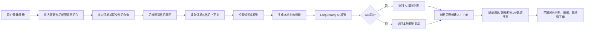
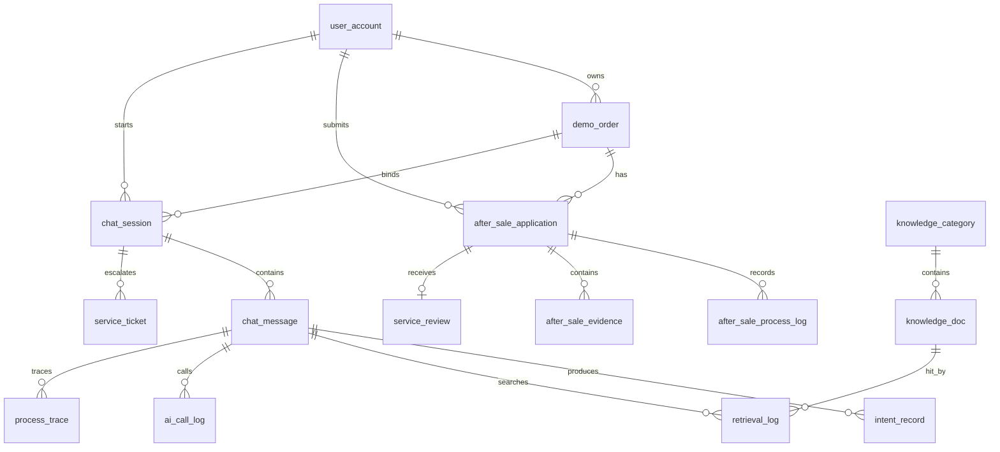
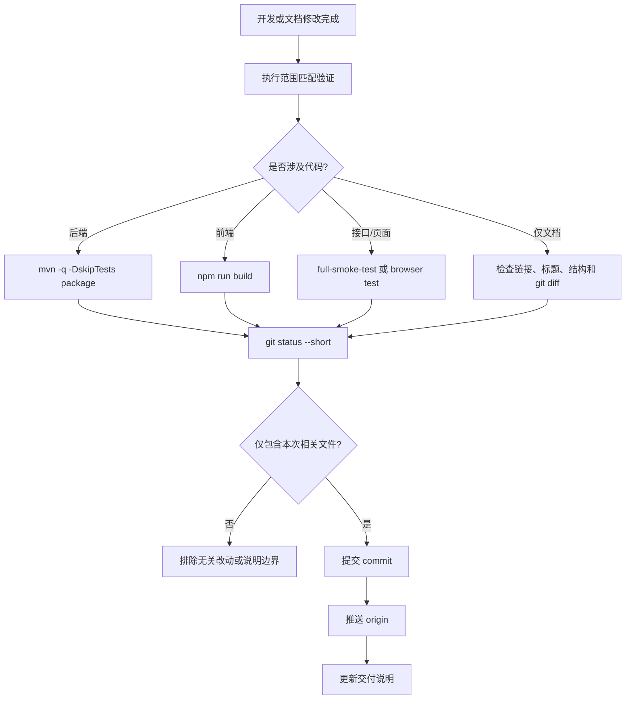

# 电商退换货智能客服系统-规格说明书

📋 基于 SDD（Spec-Driven Development）方法论设计｜适用于飞书文档编辑｜版本：v1.0  
🎯 核心原则：人定义 WHAT，系统实现 HOW｜Spec 是本项目需求、验收与答辩说明的唯一真实来源

---

## 📄 文档元信息（Meta）

| 字段 | 内容 |
|------|------|
| **文档名称** | 电商售后-退换货智能客服系统-规格说明书 |
| **文档ID** | SPEC-RET-20260512-001 |
| **负责人** | @项目负责人（待补充） / @技术负责人（待补充） |
| **核心相关方** | @前端 @后端 @测试 @指导老师 @答辩评审 |
| **优先级** | P1（课程结项核心交付） |
| **预期上线** | 2026-05-20 |
| **最后更新** | 2026-05-12 |
| **文档状态** | 🟡草稿 |
| **关联需求** | 《复杂软件系统实践》课程项目：电商退换货智能客服系统 |
| **关联设计** | `docs/backend-api-design.md`、`docs/database-design.md`、`docs/frontend-project-doc.md`、`docs/test-cases.md` |

💡 飞书配置建议

1. 将文档元信息配置为飞书「文档属性」或「多维表格」字段，便于按项目、状态、负责人检索。
2. 将 Acceptance Criteria 拆成测试任务，与 `docs/test-cases.md` 和浏览器烟测脚本关联。
3. 文档定稿后锁定编辑权限，需求变更统一记录到本文「变更历史」。

---

## 1️⃣ Problem Statement（问题定义）

✍️ 核心目标：用业务语言说明为什么要做本系统，聚焦电商售后客服的真实痛点。  
📏 验收标准：业务方或评审老师阅读后，能明确回答「这个系统解决了什么问题、为什么不是普通聊天框」。

### 1.1 当前现状（As-Is）

- 电商售后咨询高频集中在退货、换货、退款进度、物流异常、规则解释、投诉与人工客服转接等场景，问题重复度高，但处理过程需要结合订单状态、签收时间、售后状态和平台规则。
- 普通客服系统往往只保存会话内容，缺少「意图识别 -> 订单上下文 -> 知识库依据 -> AI 增强 -> 工单升级 -> 日志追踪」的完整链路，答复依据不透明。
- 仅接入大模型聊天无法保证业务可靠性：模型可能脱离订单状态给出不准确建议，模型不可用时还会影响主流程演示。
- 课程结项和答辩需要展示一个可运行、可验证、可讲清楚工程结构的复杂软件系统，而不是只展示静态页面或单一问答接口。
- 当前项目已经具备 Spring Boot + Vue 3 + MySQL + LangChain4j 的基础工程，需要用一份统一 Spec 固化功能范围、验收标准和后续开发边界。

### 1.2 核心问题（Problem）

在电商退换货售后咨询场景下，顾客无法通过一个可信、可追踪的智能客服系统快速获得结合订单状态和平台规则的处理建议，客服管理员也缺少可解释的工单、知识库和日志证据，导致售后咨询效率低、处理依据不透明、答辩展示难以证明系统复杂度和工程完整性。

### 1.3 影响范围（Scope）

| 维度 | 内容 |
|------|------|
| **涉及系统** | 顾客售后中心、管理员售后审核工作台、咨询工作台、知识库、订单管理、人工工单、SLA 中心、客户画像、日志中心、AI 测试、答辩展示中心 |
| **影响角色** | 顾客、管理员/客服、项目开发者、测试人员、指导老师、答辩评审 |
| **业务场景** | 顾客提交售后、退货/换货咨询、退款进度追问、物流异常投诉、人工客服转接、管理员审核、知识库维护、日志诊断、课程答辩 |
| **数据范围** | 演示用户、演示订单、售后申请、售后凭证、售后处理日志、知识文档、会话消息、意图记录、检索日志、AI 调用日志、处理轨迹、人工工单、服务评价 |
| **地域范围** | 课程本地演示环境，默认中国大陆教学场景；后续可扩展到真实电商业务环境 |

---

## 2️⃣ Success Metrics（成功标准）

✅ 核心原则：所有指标必须可测试、可验收、可在本地或 CI 环境复现。  
📐 指标分类：体验指标 + 效果指标 + 业务指标 + 系统指标 + 答辩指标。

### 2.1 核心指标（Must-Have）

| 指标类型 | 指标名称 | 目标值 | 测量方式 | 数据源 | 验收频率 |
|----------|----------|--------|----------|--------|----------|
| **体验** | 顾客核心售后流程完成率 | 100% 覆盖登录、查看订单、提交售后、补充凭证、查看进度、提交评价 | 浏览器角色烟测 + 人工验收 | `npm run test:browser:roles`、顾客端页面 | 每版本 |
| **效果** | 高频售后意图覆盖率 | 覆盖退货、换货、退款、物流、规则、投诉、售前咨询 7 类意图 | 用例集逐条发送并检查意图标签 | `docs/test-cases.md`、处理轨迹 | 每版本 |
| **业务** | 异常/投诉自动工单生成能力 | 投诉、人工客服、商家不处理、物流异常升级场景均可创建或复用工单 | 全链路接口烟测 + 页面验收 | `service_ticket`、人工工单页 | 每版本 |
| **系统** | 后端打包通过 | `mvn -q -DskipTests package` 成功 | Maven 构建 | `server/target` 构建日志 | 每次提交 |
| **系统** | 前端构建通过 | `npm run build` 成功 | Vite 构建 | `web/dist` 本地产物（不提交） | 每次提交 |
| **稳定性** | 全链路接口烟测失败数 | `FAILED_COUNT=0` | PowerShell 烟测脚本 | `tools/full-smoke-test.ps1` | 每版本 |
| **稳定性** | 浏览器主流程失败数 | `FAILED_COUNT=0` | Playwright 浏览器烟测 | `npm run test:browser` | 每版本 |
| **答辩** | 关键页面可演示率 | 100% 覆盖展示中心、咨询工作台、知识库、工单、日志、AI 测试 | 人工演示脚本核对 | `docs/demo-script.md` | 答辩前 |

### 2.2 辅助指标（Nice-to-Have）

- AI 增强成功时，回复来源显示为 `AI_ENHANCED`，并能在日志中心看到模型名、耗时、请求摘要和响应摘要。
- AI 失败或未配置 key 时，聊天主链路仍返回本地规则兜底回复，页面不崩溃。
- 知识库检索结果至少返回命中文档标题、命中原因、分数或快照，便于说明回复依据。
- 管理员售后审核工作台能展示待审核、补材料、完成、驳回等状态流转。
- 日志中心能聚合展示 AI 成功率、平均耗时、知识命中和处理轨迹步骤。

### 2.3 验收门槛（Go/No-Go）

- [ ] 后端 `mvn -q -DskipTests package` 通过。
- [ ] 前端 `npm run build` 通过。
- [ ] `tools/full-smoke-test.ps1` 通过，`FAILED_COUNT=0`。
- [ ] `npm run test:browser` 通过，`FAILED_COUNT=0`。
- [ ] `npm run test:browser:roles` 通过，客户与管理员路由权限隔离有效。
- [ ] 无 P0/P1 级阻塞缺陷；P2 缺陷必须有明确规避方案和记录。
- [ ] `.env`、真实密钥、`output/`、`tmp/`、`web/dist/`、`server/target/`、`node_modules/` 不进入提交。
- [ ] 答辩演示脚本可按「登录 -> 展示中心 -> 顾客售后 -> 咨询 -> 知识库 -> 工单 -> 日志」顺序跑通。

---

## 3️⃣ User Stories（用户故事）

👥 格式规范：作为 [角色]，我希望 [能力]，以便 [业务价值]。  
🎯 每个用户故事必须关联至少 1 条 Acceptance Criteria。

### 3.1 核心用户故事（Core）

#### US-001｜顾客登录与自助注册

> 作为 **顾客**，  
> 我希望 **可以使用演示账号登录或自助注册新账号**，  
> 以便 **进入自己的售后中心，查看订单并提交售后申请**。

**验收关联**：AC-001, AC-002, AC-003

#### US-002｜顾客提交售后申请

> 作为 **顾客**，  
> 我希望 **在订单详情中选择退货、换货、退款或投诉并提交原因和凭证**，  
> 以便 **让客服基于完整材料处理售后问题**。

**验收关联**：AC-004, AC-005, AC-006

#### US-003｜管理员审核售后

> 作为 **管理员/客服**，  
> 我希望 **在售后审核工作台查看待处理申请、补材料状态、SLA 风险和处理记录**，  
> 以便 **按优先级完成审核、驳回、补材料和完成处理**。

**验收关联**：AC-007, AC-008, AC-009

#### US-004｜智能客服咨询

> 作为 **顾客或客服**，  
> 我希望 **在咨询工作台输入退换货、退款、物流、投诉等问题并获得结合订单和知识库的回复**，  
> 以便 **快速得到可信的售后建议，而不是泛泛聊天回答**。

**验收关联**：AC-010, AC-011, AC-012, AC-013

#### US-005｜多轮追问承接

> 作为 **顾客**，  
> 我希望 **在上一轮咨询后继续追问“那多久到账”“现在怎么办”等省略问题**，  
> 以便 **系统能承接上下文，而不是每次都重新理解为孤立问题**。

**验收关联**：AC-014, AC-015

#### US-006｜知识库维护与检索

> 作为 **管理员/客服**，  
> 我希望 **维护售后规则、FAQ、话术和通知文档，并能调试检索结果**，  
> 以便 **让智能客服回复有可追踪的业务依据**。

**验收关联**：AC-016, AC-017, AC-018

#### US-007｜人工工单升级

> 作为 **管理员/客服**，  
> 我希望 **系统能把投诉、人工客服、物流异常等复杂问题升级为人工工单**，  
> 以便 **让智能客服与人工处理流程衔接，避免问题停留在聊天回复层面**。

**验收关联**：AC-019, AC-020, AC-021

#### US-008｜日志诊断与答辩举证

> 作为 **项目开发者/答辩者**，  
> 我希望 **查看 AI 调用、知识检索和处理轨迹日志**，  
> 以便 **向老师证明系统具备可解释性、可观测性和工程完整度**。

**验收关联**：AC-022, AC-023, AC-024

### 3.2 边缘场景故事（Edge）

#### US-E01｜AI 不可用时兜底

> 作为 **顾客**，  
> 我希望 **即使真实模型不可用，也能获得稳定的本地规则回复**，  
> 以便 **售后咨询不中断，答辩现场不受外部模型状态影响**。

**验收关联**：AC-025, AC-026

#### US-E02｜权限隔离

> 作为 **普通顾客**，  
> 我希望 **只能访问自己的售后和咨询页面，不能进入管理员后台**，  
> 以便 **系统满足基本数据隔离和角色权限要求**。

**验收关联**：AC-027, AC-028

#### US-E03｜无数据与加载状态

> 作为 **用户**，  
> 我希望 **在列表为空、检索无结果或接口加载较慢时看到明确反馈**，  
> 以便 **知道系统状态并继续下一步操作**。

**验收关联**：AC-029, AC-030

---

## 4️⃣ Acceptance Criteria（验收标准）

🎯 核心原则：定义「怎样才算完成」，是测试用例、浏览器烟测和答辩核对的直接来源。  
✍️ 编写规范：使用 Given / When / Then 格式，确保可执行。

### 4.1 认证与权限验收（Auth & RBAC）

#### AC-001｜管理员登录

> **Given** 用户进入登录页  
> **When** 使用演示管理员账号 `admin / 123456` 登录  
> **Then** 登录成功并进入 `/admin/after-sales/review`，侧边栏展示管理员菜单

#### AC-002｜顾客登录

> **Given** 用户进入登录页  
> **When** 使用演示顾客账号 `demo_customer / 123456` 登录  
> **Then** 登录成功并进入 `/customer/after-sales`，侧边栏仅展示顾客可用菜单

#### AC-003｜客户自助注册

> **Given** 用户在登录页切换到注册模式  
> **When** 输入合法用户名、密码、确认密码、展示名和手机号并提交  
> **Then** 后端创建 `CUSTOMER` 账号，返回 token，前端进入顾客售后中心

#### AC-027｜顾客禁止访问管理员页面

> **Given** 当前登录用户角色为 `CUSTOMER`  
> **When** 访问 `/showcase`、`/orders`、`/service-tickets`、`/logs` 或 `/admin/after-sales/review`  
> **Then** 前端路由重定向到 `/customer/after-sales`，后台管理数据不可见

#### AC-028｜管理员禁止进入顾客专属页

> **Given** 当前登录用户角色为 `ADMIN`  
> **When** 访问 `/customer/after-sales`  
> **Then** 前端路由重定向到 `/admin/after-sales/review`

### 4.2 顾客售后验收（Customer After-Sale）

#### AC-004｜查看我的售后

> **Given** 顾客已登录  
> **When** 进入 `/customer/after-sales`  
> **Then** 页面展示当前顾客订单、售后申请、状态标签、处理时间线和可执行操作

#### AC-005｜提交售后申请

> **Given** 顾客选择一个可售后的订单  
> **When** 填写售后类型、原因、退款金额或补充说明并提交  
> **Then** 系统创建 `after_sale_application` 记录，状态为 `SUBMITTED` 或 `UNDER_REVIEW`，并写入处理日志

#### AC-006｜补充凭证

> **Given** 售后申请状态为 `NEED_MORE_EVIDENCE`  
> **When** 顾客补充图片、文字或物流单号凭证  
> **Then** 系统写入 `after_sale_evidence`，售后时间线新增补充凭证记录

### 4.3 管理员售后验收（Admin Review）

#### AC-007｜审核队列筛选

> **Given** 管理员进入售后审核工作台  
> **When** 按状态、优先级、关键词或 SLA 风险筛选  
> **Then** 列表仅展示符合条件的售后申请，并显示申请号、订单、用户、风险等级和更新时间

#### AC-008｜审核状态流转

> **Given** 管理员打开一个待审核售后申请  
> **When** 执行通过、驳回、要求补材料、完成等操作  
> **Then** 系统更新售后申请状态，并在 `after_sale_process_log` 中记录操作人、动作、前后状态和备注

#### AC-009｜SLA 风险展示

> **Given** 售后申请存在 SLA 截止时间  
> **When** 管理员进入 SLA 中心  
> **Then** 页面按即将超时、已超时、待补材料等维度展示风险任务

### 4.4 智能客服验收（Chat & AI）

#### AC-010｜创建咨询会话

> **Given** 用户进入咨询工作台  
> **When** 点击新建会话并输入订单号  
> **Then** 后端创建 `chat_session`，前端展示会话标题、订单上下文和消息输入区

#### AC-011｜单轮退货咨询

> **Given** 用户已创建会话并绑定订单 `DD202604290001`  
> **When** 输入“这个订单能不能退货？”  
> **Then** 系统返回助手回复，并展示 `RETURN_APPLY` 意图、订单状态、知识命中、AI 状态和处理轨迹

#### AC-012｜回复来源标记

> **Given** 用户发送售后问题  
> **When** AI 调用成功  
> **Then** 助手消息 `sourceType=AI_ENHANCED`，页面展示 AI 增强标签，并在 `ai_call_log` 中记录 `SUCCESS`

#### AC-013｜处理轨迹完整

> **Given** 用户发送任意售后咨询  
> **When** 后端完成处理  
> **Then** `process_trace` 至少记录上下文解析、意图识别、订单上下文、知识检索、AI 生成或兜底、最终回复等步骤

#### AC-014｜多轮追问退款

> **Given** 上一轮用户咨询退货申请  
> **When** 用户继续问“那退款一般多久到账？”  
> **Then** 系统识别为上下文追问，并将本轮意图解析为 `REFUND_PROGRESS`

#### AC-015｜多轮追问处置建议

> **Given** 上一轮用户咨询物流异常  
> **When** 用户继续问“如果还是不动可以投诉吗？”  
> **Then** 系统结合上一轮物流异常上下文给出处置建议，并判断是否需要人工工单

#### AC-025｜AI 未配置时不阻断聊天

> **Given** `OPENAI_API_KEY` 未配置或 `AI_ENABLED=false`  
> **When** 用户发送售后咨询  
> **Then** 聊天接口仍返回 `code=1`，助手消息 `sourceType=FALLBACK`，页面展示本地兜底回复

#### AC-026｜AI 调用失败记录日志

> **Given** 模型接口超时或返回错误  
> **When** 系统触发 AI 增强  
> **Then** `ai_call_log.status=FAILED`，错误摘要被记录，最终回复走本地规则兜底且不暴露密钥

### 4.5 知识库验收（Knowledge Base）

#### AC-016｜知识文档分页查询

> **Given** 管理员进入知识库页面  
> **When** 按分类、状态、意图或关键词筛选  
> **Then** 页面以分页表格展示知识文档标题、分类、文档类型、适用意图、状态和更新时间

#### AC-017｜知识文档 CRUD

> **Given** 管理员拥有后台权限  
> **When** 新增、编辑或删除知识文档  
> **Then** 后端通过 `/knowledge-docs` 资源接口完成操作，新增/修改/删除类接口需要管理员 token

#### AC-018｜检索调试

> **Given** 管理员在知识库页面输入“退货多久到账”  
> **When** 执行检索调试  
> **Then** 页面展示命中文档、命中原因和排序信息，后端可写入 `retrieval_log`

### 4.6 人工工单验收（Service Ticket）

#### AC-019｜自动创建工单

> **Given** 用户在咨询中表达“商家一直不处理，帮我转人工”  
> **When** 后端识别为投诉或人工转接场景  
> **Then** 系统创建或复用 `service_ticket`，返回工单号、优先级、状态和处理建议

#### AC-020｜工单列表筛选

> **Given** 管理员进入 `/service-tickets`  
> **When** 按关键词、状态、优先级或意图筛选  
> **Then** 页面展示符合条件的工单，并包含用户诉求、AI 摘要、建议动作和更新时间

#### AC-021｜工单状态更新

> **Given** 管理员打开一个待处理工单  
> **When** 将状态更新为 `PROCESSING`、`RESOLVED` 或 `CLOSED`  
> **Then** 后端保存状态变化，页面刷新后展示最新状态

### 4.7 日志与可解释性验收（Observability）

#### AC-022｜AI 调用日志展示

> **Given** 系统已处理至少一次咨询  
> **When** 管理员进入日志中心的 AI 调用日志页签  
> **Then** 页面展示 provider、modelName、status、latencyMs、requestSummary、responseSummary 和 errorMessage

#### AC-023｜知识检索日志展示

> **Given** 聊天链路发生知识检索  
> **When** 管理员进入日志中心的知识检索页签  
> **Then** 页面展示 queryText、docTitleSnapshot、score、hitReason 和 createdAt

#### AC-024｜处理轨迹展示

> **Given** 管理员输入一个会话 ID  
> **When** 查询处理轨迹  
> **Then** 页面按时间线展示每个处理步骤、状态和详情 JSON 摘要

### 4.8 UX 与空状态验收（UX）

#### AC-029｜空状态引导

> **Given** 列表查询结果为空  
> **When** 用户查看结果区域  
> **Then** 页面展示明确空状态文案和下一步操作入口，不出现空白页

#### AC-030｜加载反馈

> **Given** 接口响应时间超过用户可感知阈值  
> **When** 页面等待数据返回  
> **Then** 页面展示 loading、骨架屏或按钮加载状态，避免重复提交

---

## 5️⃣ Non-Goals（明确不做）

🚫 核心目标：划定边界，防止课程项目范围失控。  
💡 采用「本期不包含」+「后续规划」结构。

### 5.1 本期明确不包含（Out of Scope）

- [ ] 不接入真实电商平台生产订单系统，本期使用 MySQL 演示订单与种子数据。
- [ ] 不实现复杂 Spring Security/OAuth2 权限中心，本期保留轻量 token + 角色校验。
- [ ] 不实现真实文件上传存储，本期凭证可使用文本、链接或演示 URL 表达。
- [ ] 不训练自有大模型，不微调模型；AI 通过 LangChain4j 调用 OpenAI-compatible 接口。
- [ ] 不把 AI 作为唯一决策来源；退换货条件、订单状态、工单创建必须由 Spring Boot 业务逻辑控制。
- [ ] 不支持多商户、多仓、多事业部隔离；本期聚焦单课程项目演示。
- [ ] 不提交真实密钥、`.env`、运行产物和本地输出目录。
- [ ] 不把答辩 PPT、论文文本、课程报告等非程序材料混入本 Spec 的功能验收范围。

### 5.2 后续演进规划（Roadmap）

| 版本 | 核心能力 | 业务价值 | 预估时间 |
|------|----------|----------|----------|
| V1.1 | 知识库语义检索与向量召回 | 提升相似问法命中率，降低关键词依赖 | 2026 Q2 |
| V1.2 | 更细粒度 RBAC 与操作审计 | 支持客服主管、普通客服、运营等不同权限 | 2026 Q2 |
| V1.3 | 售后数据看板与趋势分析 | 展示工单量、退款时长、投诉率、满意度 | 2026 Q3 |
| V2.0 | 对接真实电商订单/物流接口 | 从课程演示升级为可落地业务系统 | 2026 Q3 |
| V2.5 | 标准 Agent 工具执行链 | 让订单查询、知识检索、工单创建更可编排 | 2026 Q4 |

---

## 6️⃣ Constraints（约束条件）

⚙️ 核心目标：明确技术、业务、合规和资源层面的硬性限制。  
📌 本节约束高于临时开发偏好，任何违反约束的变更必须评审。

### 6.1 技术约束（Technical）

- **主技术栈**：必须保持 Spring Boot + Vue 3 + MySQL + LangChain4j；LangChain4j 只作为 AI 增强层。
- **后端分层**：Controller 负责接口，Service 负责业务编排，Mapper/XML 负责 MyBatis 数据访问，避免在 Controller 写复杂业务。
- **接口风格**：REST 接口优先使用资源名词和标准 HTTP 方法，例如 `GET /service-tickets`、`POST /chat-sessions/{id}/messages`。
- **数据库**：默认 MySQL 数据库为 `test3`，建表脚本为 `sql/schema.sql`，种子数据为 `sql/seed.sql`。
- **AI 可靠性**：AI 调用失败不能阻断核心聊天流程，必须保留本地规则兜底。
- **前端结构**：Vue Router、Pinia、Axios、Element Plus 保持现有工程结构，后台页面以管理系统体验为主。
- **验证要求**：代码变更后必须执行与范围匹配的验证，至少包括后端编译或前端构建；涉及接口/页面时补充接口烟测或浏览器测试。
- **提交要求**：修改完成并验证通过后，应检查 `git status --short`，只提交本次任务相关文件并推送到 GitHub。

### 6.2 业务约束（Business）

- **业务优先级**：优先保证顾客售后闭环、管理员审核闭环、智能咨询闭环和答辩演示闭环。
- **订单依据**：客服回复不能脱离订单状态、签收时间、售后状态直接给出绝对结论。
- **知识依据**：涉及规则解释的问题应尽量展示知识库命中依据。
- **人工兜底**：投诉、人工客服、商家不处理、物流异常等场景应能创建或复用人工工单。
- **角色边界**：顾客只能访问自己的售后和咨询入口；管理员访问后台管理页面。
- **演示稳定**：答辩前必须保留可复现的演示账号、演示订单和测试问题。

### 6.3 合规约束（Compliance）

- **密钥管理**：真实 API Key、数据库密码和 `.env` 不得提交到 Git；日志不得记录 Authorization Header 或完整密钥。
- **数据最小化**：AI 请求摘要和响应摘要只保存答辩与调试必要信息，避免保存敏感字段。
- **权限审计**：新增、修改、删除等后台操作需要管理员权限，关键操作写入处理日志或可追踪记录。
- **软删除优先**：知识文档、工单等业务数据优先使用软删除，避免历史日志依据丢失。

### 6.4 资源约束（Resource）

- **时间**：面向课程结项交付，优先完成可运行和可验收功能，不做过度企业化扩展。
- **环境**：默认 Windows + PowerShell 本地开发环境，兼容 Docker Compose 演示部署。
- **人力**：按个人或小组课程项目规模控制复杂度，功能必须能讲清楚、跑起来、验证通过。
- **外部依赖**：AI 模型服务可能不可用，因此系统必须支持 `SKIPPED` / `FAILED` 状态下的本地兜底。

---

## 📐 附录 A：架构方案摘要（Plan Summary）

🔗 关联方案：详见 `README.md`、`docs/backend-project-doc.md`、`docs/frontend-project-doc.md`、`docs/database-design.md`、`docs/backend-api-design.md`。

### A.1 核心流程



### A.2 关键设计决策

| 决策点 | 方案选择 | 理由 | 替代方案（已否决） |
|--------|----------|------|-------------------|
| 主栈 | Spring Boot + Vue 3 + MySQL + LangChain4j | 符合课程工程实践，后端分层清晰，AI 层可控 | FastAPI + React 原型（不符合当前项目主栈） |
| 数据访问 | MyBatis Mapper + XML | 与已有学习模型一致，SQL 可读、便于答辩讲解 | JPA 自动映射（对课程讲解不够直观） |
| AI 策略 | LangChain4j 增强 + 本地规则兜底 | 模型可用时提升自然度，不可用时保证稳定 | 纯大模型回复（不可控、易失败） |
| 权限 | 轻量 token + 角色路由 + 拦截器 | 满足课程项目和演示权限隔离，复杂度可控 | 完整 Spring Security（开发成本高） |
| 日志 | AI 调用日志 + 检索日志 + 处理轨迹 | 能证明系统可解释、可调试、非黑盒 | 只保存聊天记录（答辩证据不足） |
| 工单 | 投诉/异常场景自动或手动转人工 | 让系统从问答扩展到业务处理闭环 | 只返回建议文本（缺少后续处理） |

### A.3 接口契约（关键字段）

#### 登录请求

```http
POST /auth/login
Content-Type: application/json

{
  "username": "admin",
  "password": "123456"
}
```

#### 聊天发送请求

```http
POST /chat-sessions/{id}/messages
Content-Type: application/json

{
  "content": "这个订单能不能退货？",
  "orderNo": "DD202604290001",
  "useAi": true
}
```

#### 聊天响应关键结构

```json
{
  "code": 1,
  "msg": "success",
  "data": {
    "assistantMessage": {
      "content": "该订单已签收 3 天，通常仍在七天无理由退货范围内...",
      "intentCode": "RETURN_APPLY",
      "sourceType": "AI_ENHANCED"
    },
    "intent": {
      "intentCode": "RETURN_APPLY",
      "intentName": "退货申请",
      "confidence": 0.92,
      "method": "HYBRID"
    },
    "orderContext": {
      "orderNo": "DD202604290001",
      "orderStatus": "SIGNED",
      "logisticsStatus": "DELIVERED",
      "afterSaleStatus": "NONE"
    },
    "ai": {
      "used": true,
      "status": "SUCCESS",
      "fallbackUsed": false
    }
  }
}
```

#### 工单资源

```http
GET    /service-tickets
POST   /service-tickets
GET    /service-tickets/{id}
PUT    /service-tickets/{id}
DELETE /service-tickets/{id}
GET    /chat-sessions/{id}/service-tickets
POST   /chat-sessions/{id}/service-tickets
```

### A.4 数据模型摘要



---

## 📋 附录 B：任务拆解摘要（Tasks Summary）

🔗 完整任务可在飞书多维表格或项目看板中维护，此处列关键路径。

| 任务ID | 任务描述 | 负责人 | 预估工时 | 依赖项 | 交付物 | 状态 |
|--------|----------|--------|----------|--------|--------|------|
| TSK-001 | 数据库表结构与种子数据整理 | @后端 | 1d | - | `sql/schema.sql`、`sql/seed.sql` | 🟢 |
| TSK-002 | 登录注册与角色权限实现 | @后端/@前端 | 1.5d | TSK-001 | `/auth/*` 接口、登录页、路由守卫 | 🟢 |
| TSK-003 | 顾客售后中心实现 | @前端/@后端 | 2d | TSK-001, TSK-002 | `/customer/after-sales`、售后接口 | 🟢 |
| TSK-004 | 管理员售后审核与 SLA 中心 | @前端/@后端 | 2d | TSK-003 | `/admin/after-sales/review`、`/admin/sla` | 🟢 |
| TSK-005 | 咨询工作台与多轮上下文 | @前端/@后端 | 2d | TSK-001 | `/chat`、`ChatServiceImpl` | 🟢 |
| TSK-006 | 知识库管理与检索日志 | @前端/@后端 | 1.5d | TSK-001 | `/knowledge`、`retrieval_log` | 🟢 |
| TSK-007 | LangChain4j AI 增强与兜底 | @后端 | 2d | TSK-005, TSK-006 | `AiServiceImpl`、`ai_call_log` | 🟢 |
| TSK-008 | 人工工单与客户画像 | @前端/@后端 | 2d | TSK-003, TSK-005 | `/service-tickets`、`/admin/customers/profile` | 🟢 |
| TSK-009 | 日志诊断中心 | @前端/@后端 | 1.5d | TSK-006, TSK-007 | `/logs`、诊断指标 | 🟢 |
| TSK-010 | 答辩展示中心与演示脚本 | @前端/@文档 | 1d | TSK-002~009 | `/showcase`、`docs/demo-script.md` | 🟢 |
| TSK-011 | 构建、接口烟测、浏览器烟测 | @测试 | 1d | TSK-001~010 | 构建日志、烟测报告 | 🟡 |
| TSK-012 | SDD Spec 文档定稿 | @文档 | 0.5d | 项目真实功能 | `docs/project-spec-sdd.md` | 🟡 |

💡 飞书联动建议

- 将 `TSK-*` 任务同步到飞书多维表格，字段包括负责人、状态、依赖项、验收 AC。
- 将 `AC-*` 作为测试用例编号，测试报告直接引用 AC 编号。
- 阻塞任务标记 🔴 后自动 @负责人 和项目负责人。

---

## 🔄 变更历史（Changelog）

| 版本 | 日期 | 修改人 | 变更类型 | 变更内容摘要 | 评审状态 | 影响范围 |
|------|------|--------|----------|--------------|----------|----------|
| v1.0 | 2026-05-12 | @Codex | 初稿 | 按公司级 SDD 模板创建项目 Spec，覆盖 Problem、Metrics、Stories、AC、Non-Goals、Constraints、Plan、Tasks | 🟡待评审 | 项目需求、测试验收、答辩说明 |

✏️ 变更规范

1. 任何需求边界、接口契约、验收标准修改必须更新版本号。
2. 影响接口、数据表、权限、核心流程的变更需重新评审。
3. 评审意见使用飞书评论留痕，定稿后标记为已解决。
4. 代码实现不得绕过已定稿 Spec 中定义的 WHAT 和验收边界。

---

## ✅ 评审与验收流程（Process）

### 评审 Checklist（Pre-Review）

- [ ] **业务/课程目标**：确认系统定位是电商退换货智能客服，而不是通用聊天机器人。
- [ ] **产品/功能**：确认用户故事覆盖顾客、管理员、答辩者三类核心角色。
- [ ] **技术**：确认 Spring Boot + Vue 3 + MySQL + LangChain4j 主栈不偏移。
- [ ] **测试**：确认所有 AC 可转化为接口测试、浏览器测试或人工验收项。
- [ ] **安全/合规**：确认密钥不入库、不入日志、不提交 Git。
- [ ] **交付**：确认 README、接口文档、数据库文档、测试用例和演示脚本可互相对应。

### 验收执行流程（Post-Development）



### 发布检查清单（Release Checklist）

- [ ] 代码合并至目标分支，通过本地构建或 CI。
- [ ] 数据库变更脚本可重复执行，新增表和字段可访问。
- [ ] `.env`、密钥、运行产物和临时目录未进入提交。
- [ ] 后端、前端、接口烟测、浏览器烟测按变更范围执行完成。
- [ ] 答辩演示账号、演示订单、测试问题可用。
- [ ] README 与 Spec 中描述的功能、路由、接口保持一致。
- [ ] 回滚方式明确：可通过 Git 回退本次提交，并保留数据库备份或迁移说明。

---

## 💡 飞书场景使用指南

### 模板固化与复用

1. 将本文复制到飞书文档，作为本项目的 Spec 正式页。
2. 将文档元信息设置为多维表格属性，方便按状态、负责人、版本筛选。
3. 将 `AC-*` 复制到测试用例表，将 `TSK-*` 复制到任务看板。
4. 定稿后限制编辑权限，开放评论权限用于评审意见收集。

### AI 辅助开发规范

🤖 Spec 作为 AI 编程工具的唯一上下文：

- ✅ 推荐：将定稿 Spec 全文输入 Trae/Cursor/Codex，用 AC 条目生成测试计划。
- ✅ 推荐：用 User Stories 生成页面流程，用 Constraints 校验技术方案。
- ✅ 推荐：实现前先检查 Non-Goals，避免范围蔓延。
- ❌ 避免：让 AI 自行改变业务目标、验收指标或权限边界。
- ❌ 避免：直接采纳 AI 生成的接口或数据库变更，必须由技术负责人评审。

📌 原则重申：

**人定义价值与边界（WHAT/WHY），AI 辅助实现细节（HOW）。**

---

## 📌 附录 C：术语表（Glossary）

| 术语 | 定义 | 本项目示例 |
|------|------|------------|
| **Spec** | 规格说明书，描述系统或功能应满足的要求 | 本文档 |
| **SDD** | Spec-Driven Development，规格驱动开发 | 先写 Spec，再开发和测试 |
| **AC** | Acceptance Criteria，验收标准 | AC-011：单轮退货咨询 |
| **US** | User Story，用户故事 | US-004：智能客服咨询 |
| **RAG** | Retrieval-Augmented Generation，检索增强生成 | 先检索知识库，再让 AI 生成客服回复 |
| **LangChain4j** | Java 生态中的 AI 编排框架 | `AiServiceImpl` 通过 OpenAI-compatible 接口调用模型 |
| **本地兜底** | AI 不可用时由业务规则生成稳定回复 | `sourceType=FALLBACK` |
| **处理轨迹** | 每次咨询的后端处理步骤记录 | `process_trace` 表 |
| **人工工单** | 需要客服跟进的人工处理单据 | `service_ticket` 表 |
| **SLA** | 服务时效约束 | 售后待补材料、即将超时、风险任务 |
| **P0/P1** | 缺陷优先级，P0 为阻断，P1 为核心功能缺陷 | 无法登录、聊天主链路失败属于 P1 |

---

## 🎁 附录 D：课程答辩专属扩展字段（可选）

### 答辩展示要点

| 展示点 | 对应页面/文件 | 说明 |
|--------|---------------|------|
| 系统主线 | `/showcase` | 用一屏讲清登录、咨询、知识、工单、日志的闭环 |
| 顾客侧闭环 | `/customer/after-sales` | 展示订单、售后申请、补材料、评价 |
| 管理员侧闭环 | `/admin/after-sales/review` | 展示审核、SLA、客户画像 |
| 智能咨询 | `/chat` | 展示意图识别、订单上下文、知识命中、AI/兜底 |
| 知识库依据 | `/knowledge` | 展示规则文档维护和检索调试 |
| 人工协同 | `/service-tickets` | 展示自动转人工和工单处理 |
| 可解释日志 | `/logs` | 展示 AI 调用、检索日志、处理轨迹 |
| 模型连通性 | `/ai-test` | 展示 LangChain4j 真实模型调用或兜底状态 |

### 推荐演示问题

| 场景 | 订单号 | 问题 |
|------|--------|------|
| 退货申请 | `DD202604290001` | 这个订单能不能退货？ |
| 退款追问 | `DD202604290001` | 那退款一般多久到账？ |
| 换货申请 | `DD202604290002` | 商品有质量问题能不能换货？ |
| 物流异常 | `DD202604290003` | 物流一直不更新怎么办？ |
| 投诉转人工 | `DD202604290004` | 商家一直不处理可以投诉吗？ |

### 答辩评价指标映射

| 课程关注点 | 项目对应能力 |
|------------|--------------|
| 需求完整性 | Spec、README、开题/结项文档、测试用例 |
| 系统复杂度 | 顾客端 + 管理端 + AI + 知识库 + 工单 + 日志 |
| 工程规范 | Spring Boot 分层、Vue 组件化、MyBatis XML、RESTful 接口 |
| 数据库设计 | 用户、订单、售后、知识、会话、日志、工单多表关联 |
| AI 应用合理性 | LangChain4j 作为增强层，不替代业务规则 |
| 稳定性 | AI 失败可兜底，烟测和浏览器测试可验证 |
| 可解释性 | 意图、知识命中、处理轨迹、AI 日志可展示 |

---

✨ 模板使用最后提醒

1. 每次新增功能前，先补充或确认对应 User Story 和 AC。
2. 每次开发完成后，用 AC 反推测试用例，避免只凭页面观感验收。
3. 每次变更接口、数据表或权限边界，都要同步更新 Spec、接口文档和测试用例。
4. 答辩前 24 小时按 Release Checklist 完成一次全链路验证。

✅ 本 Spec 当前定位：课程项目级公司风格规格说明书初稿，可直接复制到飞书文档继续评审和补充负责人信息。

---

文档最后更新：2026-05-12｜维护团队：电商退换货智能客服系统项目组
